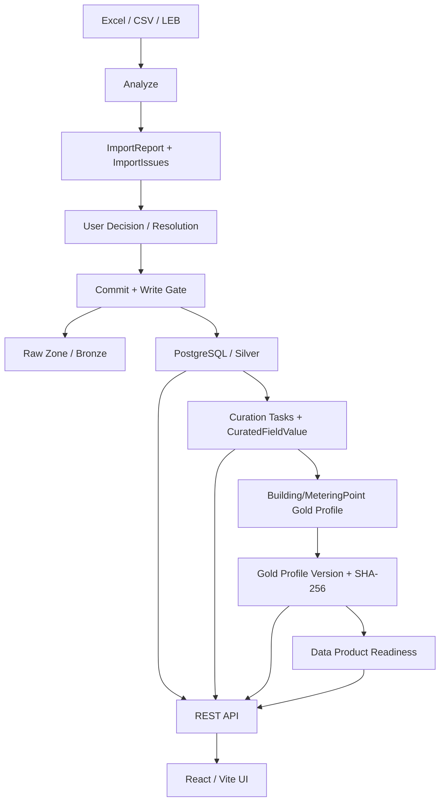
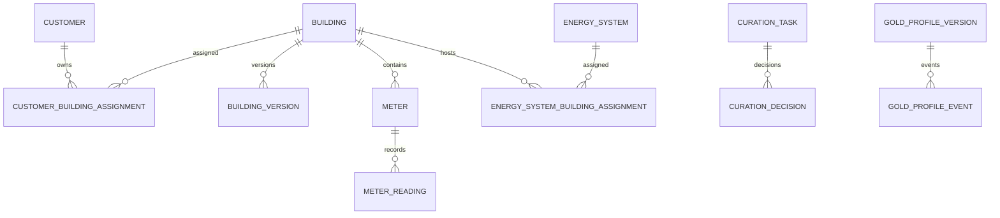
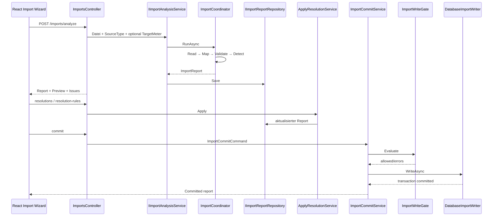
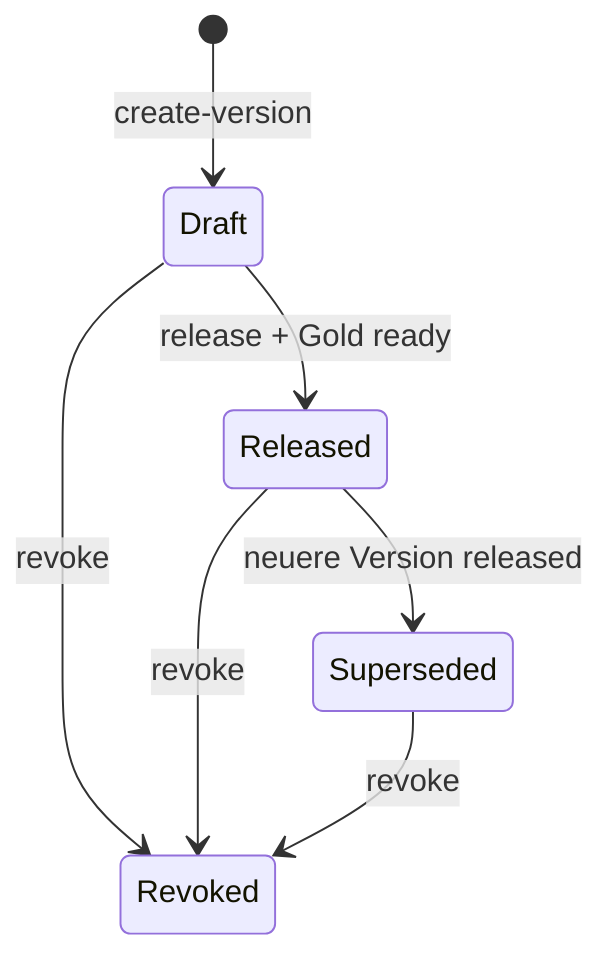
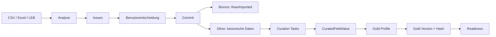

# ENSET Data Lake House – Architecture Baseline V2.0

**Status:** verbindliche MVP-Architekturreferenz  
**Stand:** 28. Juli 2026  
**Geltungsbereich:** der in diesem Repository implementierte Stand  
**Ersetzt als Hauptreferenz:** alle früheren Architecture Baselines  

Frühere Architektur-, Review- und Roadmap-Dokumente bleiben als historische
Entscheidungs- und Entwicklungsnachweise erhalten. Bei Widersprüchen ist diese
Baseline für den MVP maßgeblich. Sie beschreibt keinen Sollzustand. Aussagen
über implementierte Funktionen sind gegen Quellcode, Persistenzkonfiguration,
Controller und React-Routen geprüft.

## 1. Zweck und Leseregeln

Diese Baseline konsolidiert die technische und fachliche Architektur des
aktuellen ENSET Data Lake House MVP. Sie dient als:

- alleinige Architekturreferenz für Änderungen am MVP;
- Abgrenzung zwischen produktiv nutzbarem MVP-Kern, vorhandenen
  experimentellen Verticals und Post-MVP-Themen;
- Nachweis der implementierten Datenwege, Verantwortlichkeiten und
  Sicherheitsgrenzen;
- gemeinsame Begriffsbasis für Domain, Import, CRUD, Curation,
  Gold-Profile, Readiness, API und React UI.

Die Begriffe **Bronze**, **Silver** und **Gold** bezeichnen im MVP fachliche
Reifestufen. Sie sind keine getrennten physischen Lake-Zonen. PostgreSQL,
Import-Staging und die dateibasierte Raw Zone bilden die vorhandene technische
Persistenz.

Diese Baseline unterscheidet ausdrücklich:

1. **MVP-Vertragsumfang:** Import, CRUD, Curation, Gold-Profile,
   Gold-Versionierung, Readiness und UI.
2. **Im Repository vorhandener Legacy-/Experimental-Scope:** ältere Analytics-
   und Data-Product-Generation-Verticals. Deren Existenz wird dokumentiert,
   aber sie werden nicht zum verbindlichen MVP-Vertragsumfang erklärt.
3. **Nicht implementierter Post-MVP-Scope:** insbesondere Asset-, Grid-,
   Benchmark- und produktionsreife Data-Product-Engines.

## 2. Executive Summary

Das ENSET Data Lake House führt Kunden-, Objekt-, Zählpunkt-, Messwert-,
Import-, Qualitäts- und Kurationsinformationen in einem kanonischen
Fachmodell zusammen. Innerhalb des ENSET Universe ist es die zentrale
Datenmanagement- und Qualitätskomponente: Quellsysteme liefern Dateien und
Messprofile; das Data Lake House analysiert, validiert, protokolliert,
persistiert und kuratiert diese Daten.

Die relationale Datenbank ist die **Single Source of Truth** für kanonische
Stammdaten, Zeitreihen, Curation, Audit und Gold-Profil-Versionen. Das
hochgeladene Original kann zusätzlich in einer Raw Zone archiviert werden.
ImportReports werden im aktiven API-Setup über ein dateibasiertes Repository
persistiert; relationale ImportReport-Entities existieren ebenfalls im Modell,
sind aber nicht der aktuell registrierte API-Adapter.

Der MVP stellt folgende Fähigkeiten Ende-zu-Ende bereit:

- Excel-, CSV- und Landesenergiebuchhaltungs-Analyse;
- strukturierte ImportIssues und Benutzerentscheidungen;
- kontrollierter Commit über Write Gate und DatabaseImportWriter;
- CRUD für Customer, Building, MeteringPoint, MeterReading und EnergySystem;
- Soft Delete, Restore, `xmin`-Concurrency und Entity-Audit;
- deterministische Curation-Suggestions und Entscheidungen;
- Building- und MeteringPoint-Gold-Profile;
- unveränderliche, gehashte Gold-Profil-Versionen;
- gewichtete Data-Product-Readiness;
- REST APIs und ein React-/Vite-Frontend.

Readiness bewertet, ob Voraussetzungen für ein Data Product erfüllt sind.
**Readiness ist keine Berechnung eines Data Products.** Der verbindliche MVP
endet vor Benchmark-, Normalisierungs-, EEG- oder P2P-Berechnungen.

## 3. Architekturprinzipien

### 3.1 Single Source of Truth

Kanonische fachliche Zustände werden in PostgreSQL gehalten. Importdateien
sind Quellen, nicht konkurrierende Wahrheiten. Der Commit führt validierte
Daten in das kanonische Modell über. Gold-Snapshots referenzieren den
kuratierten Stand reproduzierbar.

### 3.2 Domain Driven Design

`Enset.Domain` enthält Entities und fachliche Enums, unter anderem Customer,
Building, Meter, MeterReading, Curation und GoldProfiles. Fachbegriffe werden
im Domainmodell ausgedrückt. Die technische Entität `Building` wird in der UI
als „Objekt“ bezeichnet; `Meter` ist im sichtbaren Fachkontext der
„Zählpunkt“ beziehungsweise `MeteringPoint`.

### 3.3 Clean Architecture

Die Abhängigkeiten zeigen nach innen:

```text
Enset.Web ──HTTP──> Enset.Api ──> Enset.Application ──> Enset.Domain
                              └──> Enset.Infrastructure ──> PostgreSQL/Dateisystem
Enset.Worker ─────────────────────> Application + Infrastructure
```

- Domain kennt keine Infrastruktur.
- Application definiert Use Cases, Contracts und Ports.
- Infrastructure implementiert EF-, Datei-, CSV- und Excel-Adapter.
- API und Worker sind Composition Roots.
- Web konsumiert ausschließlich HTTP-Verträge.

### 3.4 CQRS

CRUD verwendet getrennte `CrudCommandHandler` und `CrudQueryHandler`.
ReadModels werden über `IEntityReadService` projiziert. Schreiboperationen
laufen über `IEntityCrudService`. Es gibt keinen Event-Sourcing- oder
Message-Bus-Zwang; CQRS ist als Trennung von Lese- und Schreibpfaden
implementiert.

### 3.5 Repository Pattern

Repository-Ports werden dort eingesetzt, wo Aggregate oder Workflowzustände
eine austauschbare Persistenz benötigen, etwa:

- `IImportReportRepository`;
- Data-Product-Repositories des vorhandenen Experimental-Verticals.

CRUD und ReadModels verwenden bewusst EF Core über Infrastructure-Services
und `EnsetDbContext`; es existiert kein generisches Repository über jede
Entity. „Repository Pattern“ bedeutet daher keine pauschale Abstraktion von
EF Core.

### 3.6 Auditierbarkeit und Nachvollziehbarkeit

`BaseEntity` hält Erstellungs-, Änderungs-, Lösch-, Herkunfts- und
Importmetadaten. `EntityAuditEntry` protokolliert fachliche Änderungen.
ImportReports besitzen einen eigenen AuditTrail. Curation und Gold-Profile
führen eigene Entscheidungs- beziehungsweise Statusereignisse.

### 3.7 Versionierbarkeit

- Building-Daten werden über `BuildingVersion` fortgeschrieben.
- Gold-Profile werden als unveränderliche Snapshots versioniert.
- Kurationsregeln tragen `RuleId` und `RuleVersion`.
- `xmin` schützt konkurrierende Änderungen.

### 3.8 Deterministische Regeln, keine KI-Blackbox

Suggestions und Readiness basieren auf expliziten Regeln, Feldanforderungen,
Gewichten und Schwellen. Confidence und Reasoning werden gespeichert. Es gibt
keinen KI-Dienst, kein probabilistisches Modell und keine automatische
Fachfreigabe.

### 3.9 Bronze, Silver und Gold

| Reife | Bedeutung im MVP |
|---|---|
| Bronze | importierter oder noch unvollständiger Roh-/Ausgangsstand |
| Silver | normalisierter, vorhandener oder benutzerbearbeiteter Fachstand |
| Gold | fachlich bestätigte, für das jeweilige Profil vollständige Felder |

Gold ist reproduzierbar, weil Gold-Profile aus dem kanonischen und kuratierten
Stand erzeugt, als JSON serialisiert und per SHA-256 gehasht werden.

### 3.10 Readiness vor Berechnung

Readiness prüft Voraussetzungen und liefert Blocker, Warnungen, Guidance und
Prozentwerte. Eine Berechnung darf aus dem Readiness-Ergebnis nicht
stillschweigend abgeleitet werden.

### 3.11 API First und Frontend als Präsentationsschicht

Die React-Anwendung besitzt keine direkte Datenbank-, Import- oder
Berechnungslogik. API-Aufrufe liegen in Services. Formulare und Seiten
präsentieren und orchestrieren API-Use-Cases.

## 4. Gesamtarchitektur



### 4.1 Import

Import ist ein kontrollierter Workflow. Analyse und Commit sind getrennt.
Dateien verändern vor dem Commit keine kanonischen Nutzdaten.

### 4.2 Bronze

Bronze umfasst das unveränderte Original in der optionalen Raw Zone sowie
`ImportedMeterReading` für rohe Messwertzeilen. Parsingfehler und Rohwerte
bleiben nachvollziehbar.

### 4.3 Silver

Silver ist der normalisierte relationale Fachbestand: Customer, Building,
Meter, MeterReading und Zuordnungen. Silver ist eine fachliche Reife, keine
separate Datenbank.

### 4.4 Curation

Curation identifiziert Lücken, erzeugt deterministische Vorschläge und
verarbeitet Accept, Customize und Reject. Der jeweils aktuelle kuratierte
Feldwert wird zeitlich versioniert.

### 4.5 Gold Profile

Gold-Profile sind typisierte Lesemodelle für Building und MeteringPoint. Sie
kombinieren Domain-Fallbacks und aktuelle CuratedFieldValues.

### 4.6 Gold-Versionierung

Ein Profil kann als Snapshot versioniert werden. Identische fachliche Inhalte
erzeugen keine neue Version. Änderungen schließen die vorherige aktuelle
Version und erzeugen einen neuen Draft.

### 4.7 Data Product Readiness

Die Readiness Engine prüft einen freigegebenen Gold-Snapshot gegen einen
deterministischen Requirement-Katalog.

### 4.8 REST API

ASP.NET Core auf .NET 10 stellt versionierte `/api/v1`-Ressourcen bereit.
JWT, Policies und objektbezogener `IDataAccessScope` bilden die
Sicherheitsgrenze.

### 4.9 React UI

React, TypeScript und Vite implementieren Navigation, Listen, Detailseiten,
Formulare, Import-Wizard, Curation, Gold-Versionen und Readiness-Anzeigen.

## 5. Projekt- und Laufzeitstruktur

| Projekt | Verantwortung |
|---|---|
| `Enset.Domain` | Entities, Value-Semantik und fachliche Enums |
| `Enset.Application` | Use Cases, Ports, DTOs, Regeln, ReadModels |
| `Enset.Infrastructure` | EF Core/Npgsql, Reader, Writer, Repositories |
| `Enset.Api` | HTTP, Authentifizierung, Policies, ProblemDetails |
| `Enset.Worker` | Console-Host für den gemeinsamen Importpfad |
| `Enset.Web` | React-/Vite-Präsentationsschicht |
| `Enset.Import.Tests` | Architektur-, Import-, Persistenz- und Fachtests |

PostgreSQL ist die relationale Persistenz. Npgsql bildet `RowVersion` auf
PostgreSQL `xmin` ab. Import-Staging, Raw-Zone und JSON-ImportReports liegen
unter dem API-`App_Data`-Verzeichnis.

## 6. Domainmodell

### 6.1 Kernobjekte

| Objekt | Implementierte Verantwortung |
|---|---|
| `Customer` | Kundennummer, Organisation, Kontakt, Adresse, Herkunft und Building-Zuordnungen |
| `Building` | Gebäudenummer, Name, externe ID, Versionen, Kunden, Zählpunkte und Anlagen |
| `BuildingVersion` | versionierte Nutzung, Kategorie, Flächen, Baujahre, Adresse und Koordinaten |
| `Meter` / MeteringPoint | Zählpunktnummer, interne Bezeichnung, Medium, Einheit, Richtung, Objekt und Jahreswert |
| `MeterReading` | UTC-Zeitpunkt, Wert, ReadingType, Qualität und Intervall |
| `ImportedMeterReading` | Rohwerte, Parsingstatus, Importbezug und optional kanonischer Meterbezug |
| `Document` | persistierbares Dokument-Grundmodell mit Projektbezug |
| `EnergySystem` | Anlage mit Typ, Leistung, Betriebszeitraum und Building-Zuordnung |

### 6.2 Importobjekte

| Objekt | Bedeutung |
|---|---|
| `ImportReport` | Workflowzustand, Quelle, DTOs, Issues, Entscheidungen, Audit und Ziel-Zählpunkt |
| `ImportIssue` | typisiertes Problem mit Severity, Resolution-Metadaten und Blocking-Status |
| `ImportDecision` | aus Issues deterministisch abgeleitete Continue-/Abort-Entscheidung |
| `ImportResolutionRule` | idempotente Gruppenregel für passende Issues |
| `CsvMeterReadingMapping` | erkannte Spalten, Rohzeilen und Timestamp-/Value-Mapping |

### 6.3 Curationobjekte

| Objekt | Bedeutung |
|---|---|
| `CurationTask` | Vorschlag mit Original, SuggestedValue, Confidence, Rule und Status |
| `CurationDecision` | Benutzerentscheidung mit Vorher/Nachher, Quelle, Grund und Zeitpunkt |
| `CuratedFieldValue` | zeitlich gültiger kuratierter Feldwert mit Maturity und Provenance |
| `BuildingGoldProfile` | kuratierte Building-Sicht inklusive Nutzung, Fläche, Region und BenchmarkState |
| `MeteringPointGoldProfile` | kuratierte Zählpunkt- und Zeitreihensicht inklusive Completeness |

### 6.4 Gold- und Readinessobjekte

| Objekt | Bedeutung |
|---|---|
| `GoldProfileVersion` | Snapshot, Hash, Version, Gültigkeit, Release-Status und `xmin` |
| `GoldProfileEvent` | Created-, Released-, Superseded- oder Revoked-Ereignis |
| `DataProductReadinessResult` | gewichtetes Ergebnis für Produkt und Scope |
| `RequirementResult` | einzelne Anforderung mit Weight, Blocker, Guidance und Fulfilled |
| `ProfileVersionReference` | verwendete freigegebene Profilversion |

### 6.5 Beziehungen



## 7. Importarchitektur

### 7.1 Komponentenfluss



### 7.2 Reader

- `ExcelImportReader` und `ExcelWorkbookReader` lesen `.xlsx`/`.xlsm`.
- `CsvImportReader` und `CsvMeterReadingReader` lesen Lastprofil-CSV.
- `LebImportReader` und `LebWorkbookReader` behandeln
  Landesenergiebuchhaltungsdaten.
- ClosedXML bleibt in Infrastructure.
- CSV-Trennzeichen werden aus Kandidaten erkannt.

### 7.3 Analyzer und Coordinator

`ExcelImportAnalysisService`:

1. staged die Datei;
2. berechnet SHA-256;
3. wählt Reader und Validator anhand `SourceType`;
4. startet `ImportCoordinator`;
5. ergänzt Benutzer- und Quelldateimetadaten;
6. speichert den Report.

`ImportCoordinator` führt Read, Map, Validate, Reference Validation,
Duplication Check und Commit-Readiness aus. Er schreibt keine kanonischen
Nutzdaten.

### 7.4 Mapper und Validator

Mapper erzeugen Customer-, Building-, Meter- und MeterReading-DTOs.
Validatoren erzeugen `ImportIssue` statt unstrukturierter Fehlermeldungen.
Unter anderem werden fehlende Referenzen, ungültige Werte, Timestamps,
Nummernformate, Dubletten und strukturelle Fehler erkannt.

### 7.5 CSV-Zeitreihenmapping

`CsvMeterReadingMapping` hält:

- erkannte Header und Rohzeilen;
- Timestamp-, Value-, Quality-, MeterNumber- und Unit-Spalten;
- Feldquellen;
- optional StartTimestamp und SamplingInterval.

Ist eine Timestamp-Spalte eindeutig, wird sie verwendet. Andernfalls erzeugt
die Pipeline ein entscheidungspflichtiges Issue. Die Resolution kann eine
Timestamp-Spalte auswählen oder Timestamps deterministisch aus Startzeit und
positivem Intervall erzeugen. Eine Value-Spalte ist erforderlich.

### 7.6 Target Metering Point

`POST /imports/analyze` akzeptiert optional `TargetMeteringPointId` und
`DefaultMeterNumber`. Der Controller prüft `CanWriteMeter`. Das Ziel wird als
`AssignedMeterId` im ImportReport und AuditTrail gespeichert. Das vorhandene
`CsvMeterReadingMappingService` remappt die analysierten Zeilen auf dieses
Ziel. Die Übernahme erfolgt trotzdem erst nach Benutzerentscheidungen und
Commit.

### 7.7 Issue Detection und Resolution

Ein Issue enthält Typ, Severity, Feld, Werte, Zeile, Resolution-Optionen,
Blocking-Status und Auflösungsmetadaten. `ApplyResolutionService` unterstützt:

- Einzelentscheidung;
- passende Issues im aktuellen Import;
- kompatible Issue-Typen;
- Auswahl von CSV-Spalten;
- Timestamp-Erzeugung;
- Meter-Zuordnung;
- Kultur-/Zahlenformatentscheidungen.

Regeln tragen eine `RuleId`; Wiederholungen können idempotent erkannt werden.

### 7.8 Commit und Write Gate

Der Commit erzeugt einen `ImportWriteContext`. Das Gate verlangt:

- existierenden Report und passende ImportId;
- authentifizierten Benutzer;
- Status `ReadyToCommit`;
- keine Abort-Decision;
- keine offenen blockierenden Issues.

### 7.9 Writer

Der registrierte `DatabaseImportWriter` ist implementiert. Er führt innerhalb
einer EF-Transaktion aus:

1. Customer-Upsert;
2. Building-Upsert;
3. Customer-Building-Zuordnungen;
4. Meter-Upsert;
5. Raw-MeterReading-Insert;
6. kanonisches MeterReading-Insert ohne doppelte `(MeterId, Timestamp)`-Keys.

`Replace` wird nicht unterstützt. Der ExcelWriter bleibt als alternativer
Writer registriert. `FileSystemRawZoneWriter` archiviert das Original optional
nach erfolgreichem Ziel-Write.

### 7.10 ImportReport-Persistenz

Die API registriert derzeit `JsonImportReportRepository`. Reports werden
dateibasiert gespeichert. EF-Entities und Konfigurationen für ImportReports,
Issues und AuditEntries sind vorhanden, aber nicht der aktive API-Adapter.

## 8. CRUD-Architektur

### 8.1 Unterstützte Aggregate

| Aggregate | Create | Read | Update | Soft Delete | Restore |
|---|---:|---:|---:|---:|---:|
| Customer | ja | ja | ja | ja | ja |
| Building | ja | ja | ja | ja | ja |
| MeteringPoint | ja | ja | ja | ja | ja |
| MeterReading | ja | ja | ja | ja | nein als eigener Restore-Endpunkt |
| EnergySystem | ja | ja | ja | ja | ja |

### 8.2 Soft Delete

Customer, Building, Meter, EnergySystem und MeterReading erben `BaseEntity`.
Globale EF-Queryfilter blenden `IsDeleted` standardmäßig aus. Listen und
Details können für unterstützte Aggregate deaktivierte Datensätze gezielt
einbeziehen. Delete setzt Löschmetadaten; Restore entfernt sie.

Abhängigkeiten können Delete blockieren:

- Customer mit Building-Zuordnungen;
- Building mit Zählpunkten oder Anlagen;
- Meter mit Messwerten.

### 8.3 Concurrency

`RowVersion` wird auf PostgreSQL `xmin` abgebildet. Update, Delete, Restore
und Gold-Statuswechsel verlangen den aktuellen Token. Konflikte liefern 409.

### 8.4 Audit und Herkunft

`EnsetDbContext.SaveChanges` erzeugt EntityAuditEntries für relevante
Änderungen. `DataOrigin`, `LastImportId` und `LastModifiedSource`
unterscheiden Import, Benutzer und System. Herkunfts- und Auditfelder werden
nicht als frei manipulierbare WriteModel-Felder angeboten.

### 8.5 ReadModels

`EfEntityReadService` projiziert paginierte Listen und Details direkt in DTOs.
Counts, Messzeiträume, Kundenbezüge und Reifeinformationen werden serverseitig
ermittelt. `IDataAccessScope` wird vor der Projektion angewendet.

## 9. Curation

### 9.1 Zweck

Curation hebt fachliche Datenqualität kontrolliert von Bronze/Silver zu Gold.
Sie ist weder Import noch CRUD und berechnet keine Data Products.

### 9.2 Suggestion Engine

`EfCurationService.DiscoverTasksAsync` erzeugt deterministische Vorschläge,
unter anderem für:

- Building-Nutzungs- und Kategoriefelder;
- MeteringPoint-Energieträger;
- fehlende Building-/Customer-Zuordnungen.

Jeder Task enthält Reasoning, Confidence, RuleId und RuleVersion.

### 9.3 Entscheidungen

| Aktion | Wirkung |
|---|---|
| Accept | übernimmt den vorgeschlagenen Wert |
| Customize | übernimmt einen benutzerdefinierten Wert |
| Reject | lehnt den Vorschlag mit optionalem Grund ab |

Accept und Customize erzeugen CurationDecision und einen neuen aktuellen
CuratedFieldValue. Der vorherige Wert erhält `ValidToUtc`.

### 9.4 Provenance

`CuratedFieldValue` hält OriginalValue, CuratedValue, NormalizedValue, Source,
MaturityLevel, Confidence, Rule-Metadaten, Bestätigung, Benutzer, Zeit und
ImportId. Damit ist der fachliche Ursprung nachvollziehbar.

### 9.5 Curation Readiness

Building-Anforderungen umfassen Customer, UsageType, beheizte Fläche,
Postleitzahl und BenchmarkState. MeteringPoint-Anforderungen umfassen
Building, Customer, UsageType, Energieträger, MeasurementType, Unit,
Messzeitraum, Intervall und Qualität.

Readiness liefert Maturity, Prozent, Felder und konkrete BlockingIssues.

## 10. Gold-Profile

### 10.1 BuildingGoldProfile

Das Profil enthält unter anderem Customer, UsageType, beheizte Fläche,
Postleitzahl, Verbrauch/Produktion, HWB, BenchmarkState, Renovierungsjahr,
BuildingType, Adresse, Baujahr, Energieträger, Klimaregion,
Zusatzklassifikation, Reife und Completeness.

### 10.2 MeteringPointGoldProfile

Das Profil enthält Building und Customer, UsageType, Energieträger,
MeasurementType, Unit, Zeitraum, Intervall, Expected/Actual/Missing,
Invalid/Estimated/Interpolated, Completeness, Measured/Derived-Anteile,
BenchmarkState, Maturity und QualitySummary.

### 10.3 Snapshot und Hash

Beim Erstellen wird das fachliche Profil camelCase als JSON serialisiert.
SHA-256 über exakt dieses JSON erzeugt `SnapshotHash`. Technische ID,
Erstellungszeit und `xmin` verändern den Hash nicht.

### 10.4 Versionierung



- Identischer Hash liefert die aktuelle Version zurück.
- Ein neuer Hash schließt `ValidToUtc` der vorherigen aktuellen Version.
- Released erfordert bestandene Gold-Readiness.
- Eine neue Freigabe setzt ältere Released-Versionen auf Superseded.
- Revoke verlangt einen Grund.
- Statusübergänge erzeugen `GoldProfileEvent`.

## 11. Data Product Readiness

### 11.1 Engine

`DataProductReadinessService` wertet einen Produkt-Typ und Scope gegen die
neueste freigegebene Gold-Profil-Version aus. Fehlt eine freigegebene Version,
ist die zentrale Anforderung nicht erfüllt.

### 11.2 Requirement-Katalog

Eine Anforderung enthält:

- stabile RequirementId;
- Name und Beschreibung;
- Gewicht;
- Blocker-Kennzeichen;
- minimale Maturity;
- Fulfilled;
- konkrete Guidance.

Der Prozentwert ist:

```text
Summe Gewichte erfüllter Anforderungen / Summe aller Gewichte × 100
```

Blocker führen unabhängig vom Prozentwert zu `NotReady`.

### 11.3 Unterstützte Readiness-Typen

| Readiness-Typ | Implementierte Bewertung | Produktberechnung im verbindlichen MVP |
|---|---:|---:|
| Building Benchmark | ja | nein |
| Energy Benchmark | ja | nein |
| Normalized Load Profile | ja | nein |
| Normalized Generation Profile | ja | nein |
| EEG Matching | ja | nein |
| Peer-to-Peer Analysis | ja | nein |

Netz-, Transformator- und Tarifvoraussetzungen werden für EEG/P2P bewusst als
unerfüllte Blocker ausgegeben.

### 11.4 Readiness ist nicht Berechnung

Readiness beantwortet: „Sind definierte Voraussetzungen erfüllt?“  
Berechnung beantwortet: „Welches fachliche Ergebnis entsteht?“

Die Readiness Engine schreibt keine Benchmarkwerte, normalisiert keine
Lastprofile und führt kein Matching aus.

## 12. Zeitreihen

### 12.1 Zeitbasis

Kanonische MeterReadings verwenden UTC. API-Zeitfilter werden zu UTC
normalisiert. `from` ist inklusiv, `to` exklusiv.

### 12.2 Intervall

`IntervalSeconds` steht am MeterReading. Für Profile wird das häufigste
positive Intervall ermittelt. CSV ohne Timestamp-Spalte kann StartTimestamp
und SamplingInterval verwenden.

### 12.3 Dubletten

Die Datenbank besitzt einen fachlichen Schlüssel auf Meter und Timestamp.
Der ImportWriter überspringt bereits vorhandene Keys beim kanonischen Insert.
Die Importvorschau zählt Dubletten innerhalb der analysierten Datei.

### 12.4 Completeness

Für einen erkannten Zeitraum und ein positives Intervall gilt:

```text
Expected = floor((End - Start) / Interval) + 1
Missing  = max(0, Expected - ActualDistinct)
Completeness = Actual / Expected × 100
```

Ohne stabilen Zeitraum oder Intervall wird keine scheinpräzise Vollständigkeit
erfunden.

### 12.5 Qualitätsverteilung

Das MeteringPointGoldProfile unterscheidet:

- Missing/Invalid;
- Estimated;
- Interpolated;
- Measured/Validated;
- Derived/Calculated.

Diese Verteilung ist Bestandteil von QualitySummary und Readiness.

### 12.6 Jahreswert

Ein manueller Jahreswert wird am Meter mit Herkunft `Manual` gespeichert.
Bei einem geeigneten vollständigen Energiezeitraum kann das ReadModel den
serverseitig summierten Intervallwert als `CalculatedFromReadings` ausweisen.
Das Frontend speichert keine eigene fachliche Berechnung.

## 13. API

### 13.1 Allgemeine Konventionen

- Basis: `/api/v1`
- JSON für normale Requests/Responses
- `multipart/form-data` für Analyze
- JWT Bearer Authentication
- Listen sind paginiert
- Fehler verwenden RFC-7807 `ProblemDetails`
- typische Statuscodes: 200, 201, 400, 401, 403, 404, 409, 500
- Validation: 400; unbekannt/nicht sichtbar: 404; Concurrency/Abhängigkeit:
  409

### 13.2 Import

| Methode und Pfad | Request | Response | Hauptstatus |
|---|---|---|---|
| `POST /imports/analyze` | Datei, SourceType, Medium, DefaultMeterNumber, TargetMeteringPointId | ImportReport mit Preview/Issues | 200, 400, 403 |
| `GET /imports/{importId}` | ImportId | ImportReport | 200, 404 |
| `POST /imports/{importId}/resolutions` | Liste von Issue-Entscheidungen | aktualisierter Report | 200, 400, 404, 409 |
| `POST /imports/{importId}/resolution-rules` | Regel, SeedIssue, Scope, Action, Payload | Regelstatistik und Report | 200, 400, 404, 409 |
| `POST /imports/{importId}/commit` | Upsert/Writer/Archive-Optionen | committed Report | 200, 404, 409 |

### 13.3 Customer

| Methode und Pfad | Zweck |
|---|---|
| `GET /customers` | paginierte, gefilterte Liste |
| `GET /customers/{id}` | Detail einschließlich Objekte und Metadaten |
| `POST /customers` | anlegen |
| `PUT /customers/{id}` | mit RowVersion bearbeiten |
| `DELETE /customers/{id}?rowVersion=` | deaktivieren |
| `POST /customers/{id}/restore?rowVersion=` | wiederherstellen |

### 13.4 Building

| Methode und Pfad | Zweck |
|---|---|
| `GET /buildings` | Objektliste mit Kunde, Typ, Nutzung und Reife |
| `GET /buildings/{id}` | Detail und Beziehungen |
| `POST /buildings` | Objekt und primäre Kundenzuordnung anlegen |
| `PUT /buildings/{id}` | Stammdaten/versionierte Daten aktualisieren |
| `DELETE /buildings/{id}?rowVersion=` | deaktivieren |
| `POST /buildings/{id}/restore?rowVersion=` | wiederherstellen |

### 13.5 Meter und MeteringPoint

Lese- und Zeitreihenendpunkte liegen unter `/meters`; CRUD liegt zusätzlich
unter `/metering-points`.

| Methode und Pfad | Zweck |
|---|---|
| `GET /meters` | Zählpunktliste |
| `GET /meters/{id}` | Detail |
| `GET /meters/{id}/readings` | Raw-/15m-/Stunden-/Tages-/Monatswerte |
| `GET /metering-points` | alternative CRUD-Liste |
| `GET /metering-points/{id}` | CRUD-Detail |
| `POST /metering-points` | anlegen |
| `PUT /metering-points/{id}` | bearbeiten |
| `DELETE /metering-points/{id}?rowVersion=` | deaktivieren |
| `POST /metering-points/{id}/restore?rowVersion=` | wiederherstellen |

### 13.6 MeterReading

| Methode und Pfad | Zweck |
|---|---|
| `GET /meter-readings` | Liste, optional nach Meter |
| `GET /meter-readings/{id}` | Einzelwert |
| `POST /meter-readings` | manuellen Wert anlegen |
| `PUT /meter-readings/{id}` | Wert/Qualität ändern; Typwechsel ist blockiert |
| `DELETE /meter-readings/{id}` | Soft Delete mit RowVersion und optionalem Grund |

### 13.7 Curation

| Methode und Pfad | Zweck |
|---|---|
| `GET /curation/tasks` | filterbare Aufgaben |
| `GET /curation/tasks/{id}` | Aufgabe und Decisions |
| `POST /curation/tasks/{id}/accept` | Vorschlag bestätigen |
| `POST /curation/tasks/{id}/customize` | eigenen Wert übernehmen |
| `POST /curation/tasks/{id}/reject` | ablehnen |
| `GET /curation/statistics` | aggregierte Reife-/Taskstatistik |
| `GET /curation/buildings/{id}/profile` | BuildingGoldProfile |
| `GET /curation/metering-points/{id}/profile` | MeteringPointGoldProfile |
| `GET /curation/buildings/{id}/readiness` | Building-Curation-Readiness |
| `GET /curation/metering-points/{id}/readiness` | Meter-Curation-Readiness |
| `POST /curation/buildings/{id}/evaluate` | Regeln für Building auswerten |
| `POST /curation/metering-points/{id}/evaluate` | Regeln für Meter auswerten |

### 13.8 Gold Profiles

Basis: `/gold-profiles/{entityType}/{entityId}`.

| Methode und Pfad | Zweck |
|---|---|
| `GET /versions` | Versionshistorie |
| `GET /versions/{versionId}` | konkrete Version |
| `GET /current` | aktuelle Version |
| `POST /create-version` | Snapshot erzeugen |
| `POST /versions/{versionId}/release?rowVersion=` | freigeben |
| `POST /versions/{versionId}/revoke?rowVersion=` | zurückziehen |

### 13.9 Data Product Readiness

| Methode und Pfad | Zweck |
|---|---|
| `GET /data-product-readiness/{type}/{scopeType}/{scopeId}` | einzelne Produktbereitschaft |
| `GET /data-product-readiness/{scopeType}/{scopeId}` | alle Readiness-Typen |

### 13.10 Audit

`GET /audit-history/{entityType}/{entityId}` liefert paginierte
AuditHistoryItems für Customer, Building, Meter, EnergySystem und
MeterReading.

### 13.11 Weitere implementierte APIs außerhalb des verbindlichen MVP-Kerns

Folgende Controller existieren im Repository und dürfen bei technischer
Inventarisierung nicht verschwiegen werden:

- `/energy-systems` CRUD;
- `/analytics/*` mit Portfolio-, Verbrauchs- und Qualitätsauswertungen;
- `/data-products/*` einschließlich Generation und Versionen;
- `/auth/development-token` ausschließlich für Development.

Analytics und Data-Product-Generation stammen aus älteren Verticals. Sie
widersprechen der gewünschten MVP-Abgrenzung „keine eigentlichen Data
Products“. V2.0 friert sie daher **nicht** als verbindlichen MVP-Vertrag ein.
Eine spätere Bereinigung oder formelle Übernahme erfordert eine eigene
Architekturentscheidung.

## 14. Sicherheit und Mandantenscope

JWT Subject wird über `ExternalIdentity` zu `ApplicationUser` aufgelöst.
Globale Rollen sind `EnsetEmployee` und `EnsetAdmin`. Customer-bezogene
Rollen sind `CustomerAdmin`, `CustomerUser` und `CustomerViewer`.

Policies:

- `Authenticated`;
- `EnsetEmployee`;
- `CustomerReader`;
- `CustomerWriter`;
- `CustomerAdmin`.

Policies sind Grobfilter. `IDataAccessScope` setzt objektbezogene Filter auf
Customer, Building, Meter, MeterReading, Document und DataProduct. Nicht
sichtbare Ressourcen liefern 404; fehlendes Schreibrecht 403.

Die Ableitung verläuft:

```text
ApplicationUser
  → UserCustomerAssignment
  → Customer
  → CustomerBuildingAssignment
  → Building
  → Meter
  → MeterReading
```

## 15. Frontend

### 15.1 Technologie und Verantwortung

`Enset.Web` verwendet React, TypeScript, React Router und Vite. API-Services
kapseln HTTP. Präsentationskomponenten duplizieren keine Import- oder
Readiness-Engine.

### 15.2 Implementierte Bereiche

| Bereich | Stand |
|---|---|
| Dashboard | implementierte Übersichtsseite |
| Import | mehrstufiger Upload-, Analyse-, Resolution- und Commit-Wizard |
| Customer | Liste, Detail, Create/Edit, Soft Delete, Restore, Audit |
| Building/Objekt | Liste, Detail, Zuordnung, Reife, Zählpunkte und Anlagen |
| Meter/Zählpunkt | Liste, Detail, Messwerte, Profil-Upload, Reife |
| Data Curation | Aufgaben, Filter, Decisions und Statistik |
| Gold Profiles | Versionen, Snapshot-Erstellung, Release und Revoke |
| Readiness | Curation- und Data-Product-Readiness-Panels |
| Analytics/Data Products | vorhandene ältere UI-Verticals, nicht MVP-Baseline |

### 15.3 Formulare

Create/Edit-Formulare:

- verwenden fachliche IDs statt GUID-Eingaben;
- laden Customer-/Building-Auswahllisten;
- validieren Pflichtfelder und Feldlängen;
- schützen Dirty State;
- senden RowVersion;
- zeigen 409-Konflikte mit Neuladen/Abbrechen.

### 15.4 Navigation

Aktiv sind Dashboard, Importe, Kunden, Objekte, Zählpunkte, Objektanalyse,
Data Products, Datenqualität, Datenkurationscenter und Administration.
Mehrere Einträge sind Platzhalter oder deaktiviert. Die Navigation ist noch
nicht vollständig rollenbasiert; `isAdmin` ist im aktuellen Code fest auf
`true` gesetzt. Das ist eine bekannte Inkonsistenz zur API-Autorisierung.

## 16. Vollständiger Datenfluss



1. Datei wird gestaged und gehasht.
2. Reader und Mapper erzeugen Import-DTOs.
3. Validator und Detektoren erzeugen Issues.
4. Benutzer löst blockierende Issues.
5. Write Gate prüft den Report.
6. Writer archiviert Rohdaten und schreibt relationale Daten.
7. Curation entdeckt fachliche Lücken.
8. Entscheidungen erzeugen zeitlich gültige CuratedFieldValues.
9. Gold-Profil aggregiert den aktuellen Fachstand.
10. Snapshot und Hash frieren den Stand ein.
11. Release verlangt Gold-Readiness.
12. Data-Product-Readiness bewertet die freigegebene Version.

Es folgt im verbindlichen MVP keine eigentliche Data-Product-Berechnung.

## 17. Nicht Bestandteil des verbindlichen MVP

Die folgenden Bereiche sind nicht Bestandteil der V2.0-MVP-Architektur:

- Asset Layer;
- Grid Layer;
- produktionsreife Time Series Engine;
- Benchmark Engine und Benchmarkberechnung;
- Lastprofilnormalisierung als Data Product;
- EEG Matching;
- Peer-to-Peer-Berechnung;
- Tarifverwaltung;
- Transformatoren und Netzebenen;
- Netzmodell;
- Anonymisierung;
- produktionsreife Data-Product-Berechnung;
- Customer Aggregation als verbindliches Data Product;
- Region Aggregation als verbindliches Data Product;
- KI-gestützte Regeln.

Einzelne Domainklassen, Controller oder ältere Vertical-Slices können Namen
aus dieser Liste tragen. Das macht sie nicht automatisch zu einem
abgenommenen MVP-Modul. Insbesondere vorhandene Analytics- und Generation-
Prototypen werden in Abschnitt 13.11 als Code-Inkonsistenz ausgewiesen.

## 18. MVP-Abgrenzung

Der verbindliche MVP endet bei:

```text
Import
  + CRUD
  + Curation
  + Gold Profile
  + Gold Versionierung
  + Readiness
  + REST API
  + React UI
```

Der MVP berechnet keine fachlich freigegebenen Benchmarks, normalisierten
Profile, EEG-Matches oder P2P-Ergebnisse.

## 19. Bekannte Inkonsistenzen

| Inkonsistenz | Bewertung für V2.0 |
|---|---|
| AnalyticsController und DataProductsController implementieren ältere Berechnungsverticals | vorhanden, aber nicht verbindlicher MVP-Scope |
| Domain enthält weitere Grundmodelle wie Marketplace, Mobility, EnergyCommunity und Subscriptions | persistierbare/konzeptionelle Modelle, keine vollständigen MVP-Module |
| API registriert JSON-ImportReportRepository, obwohl relationale ImportReport-Entities existieren | aktiver Adapter ist JSON; EF-Modell ist nicht maßgeblich für den API-Workflow |
| `/meters` und `/metering-points` teilen Lese-/CRUD-Verantwortung | aktuell implementiert; spätere Konsolidierung sinnvoll |
| React-Navigation setzt `isAdmin = true` | UI-Sichtbarkeit ist schwächer als API-Autorisierung |
| Dokument-/Report-/Admin-Seiten enthalten Platzhalter | nicht als funktionsfähige Module dokumentiert |
| Readiness-Anforderungen prüfen teilweise nur das Vorhandensein einer freigegebenen Profilversion | deterministisch, aber fachlich grob; keine Berechnung |
| Ältere Dokumente behaupten, DatabaseImportWriter, Auth oder React Wizard fehlten | nach aktuellem Code falsch |

## 20. Veraltete Aussagen, die nicht übernommen werden

Aus früheren Dokumenten wurden bewusst verworfen:

- „DatabaseImportWriter ist nur ein NotSupported-Platzhalter“;
- „React Import Wizard ist nicht implementiert“;
- „Authentifizierung und Autorisierung fehlen“;
- „Customer-, Building- und Meter-Seiten sind nur Gerüste“;
- „Curation und Gold-Versionierung fehlen“;
- „Import unterstützt nur Excel“;
- „ImportReports sind ausschließlich relational“;
- ältere Migrationslisten als vermeintlich aktueller Snapshot;
- Zielbilder für TimescaleDB oder physisch getrennte Bronze/Silver/Gold-Zonen.

## 21. Eingefrorene Architekturentscheidungen

Für den MVP gelten verbindlich:

1. PostgreSQL ist die kanonische Single Source of Truth.
2. Bronze/Silver/Gold sind fachliche Reifestufen.
3. Analyse und Commit bleiben getrennt.
4. Kein Import-Commit ohne Write Gate.
5. Keine parallele CSV-Sonderpipeline für MeteringPoints.
6. Curation ist deterministisch und benutzerbestätigt.
7. Gold-Profile sind typisierte, reproduzierbare Snapshots.
8. SHA-256 identifiziert den fachlichen Snapshot.
9. Release erfordert Gold-Readiness.
10. Readiness ist nicht Data-Product-Berechnung.
11. API ist die einzige Frontend-Schnittstelle.
12. Objektzugriffe werden zusätzlich zu Policies mandantengesichert.
13. `xmin` ist der Concurrency-Mechanismus.
14. Audit und Provenance sind Teil des Fachmodells, keine reine Logausgabe.
15. Der verbindliche MVP endet bei Readiness und UI.

## 22. Post-MVP Roadmap

Dieser Ausblick ist kein Bestandteil des MVP:

1. **Phase 1 – Asset Layer**
2. **Phase 2 – Grid Layer**
3. **Phase 3 – Time Series Engine**
4. **Phase 4 – Benchmark Engine**
5. **Phase 5 – Data Products V2**

Jede Phase benötigt vor Implementierung eine eigene fachliche und technische
Architekturentscheidung.

## 23. Quellen dieser Baseline

### 23.1 Primäre Quellen

- Quellcode unter `src/Enset.Domain`;
- Application-Contracts und Use Cases;
- Infrastructure-Implementierungen und EF-Konfigurationen;
- sämtliche Controller unter `src/Enset.Api/Controllers`;
- API-Fehlerbehandlung und Autorisierung;
- React-Router, Navigation, Seiten, Features und Services;
- aktueller EF-Migrationssnapshot;
- automatisierte Tests.

### 23.2 Historische Dokumentquellen

Als Kontext, nicht als Implementierungsnachweis:

- `docs/ARCHITECTURE_BASELINE_V1_0_RC.md`;
- `docs/00_Overview.md` bis `docs/15_Analytics_Data_Products.md`;
- `docs/13_User_Tenant_Authorization.md`;
- `docs/14_Landesenergiebuchhaltung_Import.md`;
- `docs/curation.md`;
- `docs/gold-profile-versioning.md`;
- Dokumente unter `docs/Decisions`;
- `docs/DATA_PRODUCT_ENGINE_V1_0_RC.md`.

Bei Abweichungen wurde der aktuelle Code bevorzugt.

## 24. Pflege dieser Baseline

Eine Änderung an folgenden Punkten erfordert eine Aktualisierung dieser
Baseline oder ein nachfolgendes verbindliches Architekturentscheidungsdokument:

- MVP-Systemgrenze;
- Datenzonen- oder Persistenzmodell;
- Import-Commit-Grenze;
- Curation-Maturity-Semantik;
- Gold-Snapshot- oder Hashbildung;
- Readiness-Katalog;
- Mandantenscope;
- API-Ressourcenstruktur;
- Aufnahme einer echten Data-Product-Berechnung in den verbindlichen Scope.

Historische Baselines dürfen nicht überschrieben werden. Eine neue Baseline
muss ihren Geltungsbereich und die abgelöste Referenz ausdrücklich nennen.
