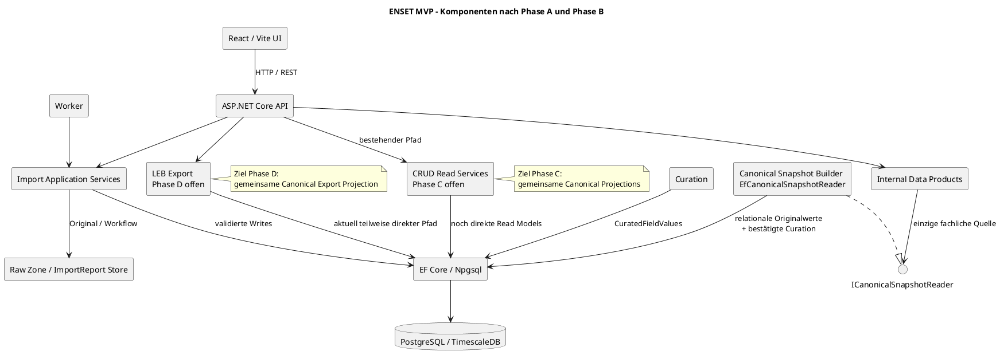
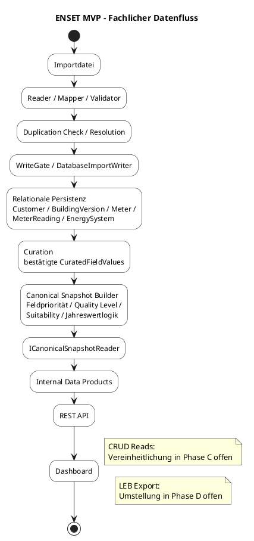

# ENSET Data Lake House – Architecture Baseline V2.0

**Status:** verbindliche MVP-Architekturreferenz

**Stand:** 30. Juli 2026

**Geltungsbereich:** tatsächlich implementierter Stand nach Phase A und Phase B

**Offene Zielphasen:** Phase C – CRUD vereinheitlichen; Phase D – LEB-Export umstellen

Diese Baseline ist die maßgebliche Architekturreferenz für die verbleibenden
MVP-Arbeitspakete. Historische Architektur-, Review- und Roadmap-Dokumente
bleiben als Entscheidungsnachweise erhalten. Bei Widersprüchen gilt diese
Baseline.

Die Baseline trennt konsequent zwischen:

- implementiertem Iststand;
- dokumentierten Einschränkungen;
- offener Zielarchitektur der Phasen C und D.

Sie stellt offene Funktionen nicht als implementiert dar.

## 1. Architekturauftrag

ENSET importiert, validiert, persistiert, kuratiert und konsolidiert Customer-,
Building-, Meter-, MeterReading- und EnergySystem-Daten. Für fachliche
Downstream-Projektionen gilt:

> Canonical Snapshots sind die Single Source of Business Truth der Internal
> Data Products.

Die relationale Persistenz bleibt die operative Datenbasis. Sie ist jedoch
nicht mehr die unmittelbare fachliche Projektionsquelle der Internal Data
Products. Bestätigte Kuration, gültige Originalwerte, Quality Level,
Suitability und Messwertzusammenfassungen werden in der
Canonical-Snapshot-Schicht zusammengeführt.

## 2. Verbindliche Begriffe

### 2.1 Canonical Snapshot

Ein Canonical Snapshot ist der aktuell fachlich konsolidierte Zustand eines
Datensatzes. Er kann unvollständig sein und enthält, soweit für den
Entitätstyp implementiert:

- den bestverfügbaren fachlichen Wert je Feld;
- bestätigte kuratierte Werte;
- gültige importierte oder relationale Originalwerte;
- Feldherkunft beziehungsweise Versionsquelle;
- Quality Level und Qualitätsmetriken;
- anwendungsfallspezifische Suitability;
- technische Versionsinformationen;
- bei Metern eine kanonische Messwertzusammenfassung.

Die Feldpriorität lautet:

1. bestätigter, aktuell gültiger kuratierter Wert;
2. gültiger importierter beziehungsweise relationaler Originalwert;
3. `null`.

Unbestätigte Vorschläge werden nicht als fachliche Wahrheit verwendet.
Unbekannte oder uneindeutige Werte werden nicht geraten.

Ein Canonical Snapshot ist nicht automatisch Gold. Bronze- und
Silver-Snapshots bleiben sichtbar, abfragbar, Bestandteil der Internal Data
Products und Bestandteil der Portfoliozahlen.

### 2.2 Quality Level

Das Quality Level beschreibt die allgemeine Datenqualität:

| Level | Bedeutung |
|---|---|
| Bronze | deutlich unvollständiger oder noch nicht ausreichend konsolidierter Stand |
| Silver | fachlich nutzbarer, aber nicht vollständig bestätigter Stand |
| Gold | vollständiger und bestätigter Stand gemäß zentraler Qualitätslogik |

Die Bewertung berücksichtigt Vollständigkeit, Validität, Konsistenz, Kuration
und Nachvollziehbarkeit. Quality Level ist keine allgemeine
Verwendungsfreigabe und kein globaler Filter.

### 2.3 Suitability

Suitability beschreibt ausschließlich die Eignung für einen konkreten
Anwendungsfall oder ein konkretes Data Product. Die Grundzustände sind:

- `Suitable`;
- `NotSuitable`.

Implementierte Contracts unterscheiden LEB-, Navigator-, Benchmark- und
ISO-50001-Suitability. Quality Level und Suitability beeinflussen sich nicht
automatisch. Damit sind sowohl `Silver + LEB Suitable` als auch
`Gold + Navigator NotSuitable` zulässig.

Eine generische Suitability Rule Engine ist nicht implementiert.

### 2.4 Readiness

`Readiness` kommt in bestehenden technischen APIs, Klassen und UI-Texten noch
vor. Der Begriff ist dort als Legacy-Bezeichnung für eine
anwendungsfallspezifische Voraussetzungen- beziehungsweise Suitability-Prüfung
zu verstehen. Er ist kein allgemeiner Status, der einen Datensatz global
verwendbar oder unverwendbar macht.

Bevorzugte Begriffe sind:

- Quality Level;
- Suitability;
- Validation Result;
- Export Validation.

### 2.5 Gold, Freigabe und aktuelle Version

Folgende Zustände sind voneinander unabhängig:

- Quality Level `Gold`;
- `GoldProfileVersion.ReleaseStatus`;
- aktuelle kanonische Projektion;
- dauerhaft materialisierte Snapshot-Version;
- anwendungsfallspezifische Suitability.

`Released`, `Gold` und `IsCurrent` bedeuten nicht automatisch dasselbe.

## 3. Architekturprinzipien

1. **Single Source of Business Truth**

   Canonical Snapshots sind die einzige fachliche Quelle der Internal Data
   Products.

2. **Preserve Originals**

   Originale fachliche Identifikatoren und Importwerte bleiben
   nachvollziehbar erhalten.

3. **Curate Centrally**

   Bestätigte kuratierte Werte werden ausschließlich im Snapshot-Builder mit
   Originalwerten zusammengeführt.

4. **No Guessing**

   Fehlende oder uneindeutige Werte bleiben null beziehungsweise Unknown,
   sofern Unknown die bestehende technische Enum-Semantik ist.

5. **Quality Is Not Usability**

   Bronze, Silver und Gold beschreiben Qualität, keine allgemeine
   Verwendungsfreigabe.

6. **Suitability Is Context-Specific**

   Eignung wird je Data Product oder Zielsystem bewertet.

7. **One Annual Value Logic**

   Jahreswerte werden zentral und ohne Hochrechnung bestimmt.

8. **Technical IDs Are Not Business Labels**

   GUIDs werden nicht als Kunden-, Gebäude- oder Zählpunktbezeichnungen
   verwendet.

9. **Products Do Not Read Raw Business Tables**

   Fachliche Internal Data Products lesen relationale Fachtabellen und
   `CuratedFieldValues` nicht direkt.

10. **Exports Are Projections**

    Exporte sollen kanonische Daten serialisieren und keine eigene fachliche
    Wahrheit aufbauen. Dieses Prinzip ist für den LEB-Export Ziel der offenen
    Phase D.

## 4. Gesamtarchitektur

### 4.1 Komponentendiagramm



### 4.2 Fachlicher Datenfluss



Der gestrichelt beziehungsweise als Hinweis dargestellte Zielpfad für CRUD und
LEB ist nicht Teil des aktuellen Implementierungsstands.

## 5. Projekt- und Laufzeitstruktur

| Projekt | Verantwortung |
|---|---|
| `Enset.Domain` | Entities, Beziehungen und fachliche Enums |
| `Enset.Application` | Use Cases, Ports, Importmodelle, Canonical-Snapshot-Contracts, Products |
| `Enset.Infrastructure` | EF Core, Reader, Writer, Curation, Snapshot-Builder und Adapter |
| `Enset.Api` | REST, Authentifizierung, Policies und ProblemDetails |
| `Enset.Worker` | Host für den gemeinsamen Importpfad |
| `Enset.Web` | React-/Vite-Präsentationsschicht |
| `Enset.Import.Tests` | Import-, Persistenz-, Contract- und Architekturtests |

PostgreSQL ist die relationale Persistenz; TimescaleDB kann für Zeitreihen
verwendet werden. Das Repository enthält außerdem dateibasierte Import- und
Raw-Zone-Adapter.

## 6. Import- und Persistenzschicht

### 6.1 Workflow

```text
Reader
  → Importmodelle
  → Mapper
  → Validation
  → Duplication Check
  → Resolution
  → WriteGate
  → DatabaseImportWriter
  → relationale Persistenz
```

Analyse und Commit sind getrennt. Vor dem Commit werden keine kanonischen
Nutzdaten verändert. `ImportReport`, `ImportIssue`, Entscheidungen,
Resolution-Regeln und AuditTrail halten den Workflow nachvollziehbar.

### 6.2 Reader und Formate

- CRM-Excel wird über die vorhandenen Excel-/Workbook-Reader verarbeitet.
- Lastprofil-CSV wird über den CSV-MeterReading-Pfad verarbeitet.
- LEB-CSV wird über den LEB-Reader und `LebWorkbookMapper` verarbeitet.
- Unstrukturierte Fehler werden als typisierte ImportIssues dargestellt.

### 6.3 Phase-A-Persistenzregeln

Phase A hat folgende Persistenzregeln umgesetzt:

- `BuildingVersion` wird bei CRM- und LEB-Importen angelegt.
- Gebäudeänderungen werden historisiert.
- Fehlende Update-Felder löschen vorhandene Werte nicht.
- Adresse, Ort, Baujahre, Flächen, Geschosszahl und Volumen werden bei
  vorhandener Quelle in die BuildingVersion übernommen.
- Nullable Gebäude-Enums verhindern erfundene Defaultwerte.
- Die originale LEB-`ZId` wird unverändert als `Meter.MeterNumber`
  gespeichert.
- `Meter.Name` bleibt eine getrennte fachliche Bezeichnung.
- `Meter.Id` bleibt eine technische GUID.
- LEB-`AnnualTotal`, Einheit und Bezugsjahr werden am Meter persistiert.
- LEB- und Lastprofil-Zeitreihen verwenden
  `MeterReadingType.IntervalValue`.
- `Meter.Quantity` wird nur bei eindeutiger Einheit abgeleitet.
- `IntervalSeconds` wird nur aus einem expliziten oder über die Serie
  nachweislich konstanten Raster übernommen.
- Gemischte Intervalle und unbekannte Einheiten erzeugen Warnungen.
- Negative oder ungültige Jahresgesamtwerte erzeugen Importfehler.

Nicht vorhandene Werte werden nicht als `0`, leerer String oder erfundener
Fachwert persistiert.

### 6.4 Migration aus Phase A

`PersistPhaseAImportFields` ergänzt:

- `Meter.AnnualValueReferenceYear`;
- `Address.City`;
- nullable `PrimaryUseType`, `BuildingCategory` und `OwnershipType` in
  `BuildingVersion`.

Phase B erzeugte keine Migration.

### 6.5 BuildingVersion

`BuildingVersion` bildet die relationale Gebäudehistorie:

- beim Erstimport entsteht eine aktive Version;
- bei einer fachlichen Aktualisierung entsteht eine Folgever­sion;
- die vorherige Version wird zeitlich geschlossen;
- nicht gelieferte Felder werden aus der vorherigen aktiven Version erhalten;
- Ort und vorhandene fachliche Gebäudeattribute werden versioniert.

Der Gebäudezustand besitzt weiterhin kein fachlich geeignetes Domainfeld.
Dieser Punkt ist eine offene Domainentscheidung und kein Fehler der
Canonical-Snapshot-Schicht. Es wurde bewusst kein ungeeignetes Ersatzfeld
eingeführt.

### 6.6 Meter-Semantik

| Feld | Verbindliche Semantik |
|---|---|
| `Meter.Id` | technische GUID; niemals fachliche Zählpunktnummer |
| `Meter.MeterNumber` | originale fachliche Zählpunktnummer; bei LEB unveränderte `ZId` |
| `Meter.Name` | optionale fachliche Bezeichnung, getrennt von MeterNumber |
| `ReadingType` | bei LEB- und Lastprofil-Zeitreihen `IntervalValue` |
| `Quantity` | aus eindeutiger Einheit, etwa kWh → Energy, kW → Power, m³ → Volume |
| `IntervalSeconds` | nur explizit oder bei nachweislich konstantem Raster |
| `AnnualTotal` | importierter Jahresgesamtwert mit Einheit und Bezugsjahr |

Bei gemischten Intervallen bleibt `IntervalSeconds` null. Eine uneindeutige
Einheit führt zu `Quantity.Unknown` und einer nachvollziehbaren Warnung.

## 7. Curation-Schicht

`CurationTask` und `CurationDecision` bilden Vorschläge und Entscheidungen ab.
`CuratedFieldValue` hält zeitlich gültige kuratierte Feldwerte samt Quelle,
Maturity, Bestätigung, Regel und Provenance.

Für Downstream-Fachwerte gilt:

```text
CuratedFieldValues
  → Canonical Snapshot Builder
  → Canonical Snapshot
  → Downstream Consumer
```

`CuratedFieldValues` dürfen nicht direkt von fachlichen Internal Data
Products, REST-Projektionen oder Exporten ausgewertet werden. Für die Internal
Data Products ist diese Regel umgesetzt. CRUD und LEB werden in Phase C
beziehungsweise Phase D auf den Zielpfad gebracht.

Nur bestätigte, aktuell gültige kuratierte Werte besitzen Vorrang vor
Originalwerten. Unbestätigte Suggestions verändern die fachliche Wahrheit
nicht.

## 8. Canonical-Snapshot-Schicht

### 8.1 Contracts

Die Application-Schicht definiert:

- `CustomerCanonicalSnapshot`;
- `BuildingCanonicalSnapshot`;
- `MeterCanonicalSnapshot`;
- `CanonicalReadingSummary`;
- `EnergySystemCanonicalSnapshot`;
- `CanonicalSnapshotSet`;
- `SnapshotQuality`;
- `SnapshotSuitability`;
- `CanonicalVersion`;
- `ICanonicalSnapshotReader`.

`EfCanonicalSnapshotReader` implementiert den Builder und Reader in der
Infrastructure-Schicht.

### 8.2 Fachliche Verantwortung

Die Schicht zentralisiert:

- Feldpriorität;
- null-sichere Originalwertübernahme;
- bestätigte Kuration;
- Quality-Level-Berechnung;
- Abgrenzung der Suitability;
- Messwertanzahl und Zeitraum;
- ReadingType, Quantity und Intervall;
- Quality-Flag-Zusammenfassung;
- Jahreswert und Jahreswertstatus;
- technische Versionsinformationen.

### 8.3 Quality Level

`SnapshotQuality` enthält:

- `Level`;
- `CompletenessPercentage`;
- `ValidityPercentage`;
- `ConsistencyPercentage`;
- `CurationPercentage`.

Die Internal Data Products übernehmen dieses Ergebnis. Sie berechnen keine
separate Gold-Reife. Bronze und Silver werden nicht global herausgefiltert.

### 8.4 Suitability

`SnapshotSuitability` hält LEB-, Navigator-, Benchmark- und
ISO-50001-Eignung getrennt vom Quality Level. Bestehende Product-Felder mit
Readiness-Namen werden als anwendungsfallspezifische Suitability-Projektionen
behandelt.

Die aktuelle Implementierung ist eine schlanke regelbasierte Abgrenzung, keine
generische Rule Engine.

### 8.5 Messwertzusammenfassung

`CanonicalReadingSummary` liefert strukturierte Werte:

- `MeasurementCount`;
- `PeriodStart`;
- `PeriodEnd`;
- `Unit`;
- `ReadingType`;
- `Quantity`;
- `IntervalSeconds`;
- Invalid-, Estimated-, Interpolated-, Measured- und Derived-Counts;
- `CompletenessPercentage`;
- `AnnualValue`;
- `AnnualValueStatus`.

Das Backend erzeugt daraus keine zusammengesetzten UI-Zeichenketten.

### 8.6 Versionierung und Materialisierung

Es sind vier Konzepte zu unterscheiden:

1. `BuildingVersion` historisiert relationale Gebäudeattribute.
2. `GoldProfileVersion` versioniert vorhandene Building- und
   MeteringPoint-Profil-Snapshots mit Hash, Gültigkeit und Release-Status.
3. `CanonicalVersion` stellt Versionsmetadaten im allgemeinen
   Snapshot-Contract bereit.
4. Die aktuelle kanonische Projektion kann dauerhaft materialisiert oder
   deterministisch berechnet sein.

Aktueller Stand:

- vorhandene Building- und MeteringPoint-`GoldProfileVersion`-Strukturen
  liefern die Grundlage für eine konsistente Materialisierung;
- Customer- und EnergySystem-Snapshots werden deterministisch projiziert,
  sind aber nicht dauerhaft materialisiert;
- für Customer und EnergySystem ist damit die vollständige Isolation gegenüber
  direkten relationalen Änderungen noch nicht durch persistierte
  Snapshot-Versionen gewährleistet;
- es ist keine zweite parallele Snapshot-Persistenz vorgesehen;
- eine spätere Erweiterung soll kontrolliert die bestehende
  `GoldProfileVersion`-Struktur nutzen.

## 9. Zentrale Jahreswertlogik

`CanonicalAnnualValue` ist die zentrale Jahreswertregel der fachlichen
Internal Data Products.

| Feld | Bedeutung |
|---|---|
| `AnnualValue` | fachlicher Jahreswert oder null |
| `AnnualValueStatus` | `CompleteYear`, `IncompleteYear` oder `NotAvailable` |
| `MeasurementCount` | Anzahl berücksichtigter Messwerte |
| `PeriodStart` | erster berücksichtigter Messzeitpunkt |
| `PeriodEnd` | letzter berücksichtigter Messzeitpunkt |
| `AnnualValueReferenceYear` | persistiertes Bezugsjahr, soweit vorhanden |
| `AnnualValueUnit` | fachliche Einheit des Wertes |

Regeln:

- Es gibt keine Hochrechnung.
- Drei, acht oder elf vorhandene Monate ergeben `IncompleteYear` und
  `AnnualValue = null`.
- Ein fachlich geeignetes vollständiges Jahr ergibt `CompleteYear`.
- Ohne geeignete Messwerte gilt `NotAvailable`.
- Intervallwerte werden für das vollständige Jahr summiert.
- Kumulative Werte werden nach bestehender zentraler Semantik aus End- und
  Anfangswert bestimmt.
- Internal Data Products aggregieren nur `CompleteYear`-Werte.
- Ein persistierter `AnnualTotal` wird nicht ungeprüft als alternative
  Product-Berechnung verwendet.

Die Products verwenden diese Logik bereits. CRUD-ReadModels werden in Phase C
und der LEB-Export in Phase D auf dieselbe Projektion vereinheitlicht.

## 10. Internal Data Products

### 10.1 Product-Katalog

- `CustomerSummaryProduct`;
- `BuildingSummaryProduct`;
- `MeterSummaryProduct`;
- `PortfolioSummaryProduct`;
- `ImportQualityProduct`.

### 10.2 Fachliche Products

Die ersten vier Products beziehen fachliche Werte ausschließlich über
`ICanonicalSnapshotReader`.

```text
Internal Data Product
  → ICanonicalSnapshotReader
  → Canonical Snapshot
```

Direkte fachliche Abfragen auf Customer, Building, BuildingVersion, Meter,
MeterReading, EnergySystem oder `CuratedFieldValues` wurden aus dem Product
Service entfernt. Ein Architekturtest schützt diese Abhängigkeitsregel.

Portfoliozahlen schließen Bronze-, Silver- und Gold-Snapshots ein.
Quality-Level-Verteilungen und Suitability werden getrennt dargestellt.

### 10.3 ImportQualityProduct als technische Ausnahme

`ImportQualityProduct` darf direkt lesen:

- `ImportReport`;
- `ImportIssue`;
- Import-Auditdaten;
- technische Versionsmetadaten;
- technische Statusinformationen.

Diese Quellen beschreiben Importqualität und Workflow, nicht parallele
fachliche Customer-, Building-, Meter- oder EnergySystem-Werte.

### 10.4 REST

Die internen Product-Endpunkte liegen unter
`/api/v1/internal-data-products`. Meter-Repräsentationen wurden additiv
ergänzt um:

- `ReadingType`;
- `Quantity`;
- `IntervalSeconds`;
- `AnnualValueStatus`.

Quality Level und Suitability werden semantisch getrennt serialisiert. Die
Erweiterung ist additiv; Phase B erforderte keine UI-Anpassung.

## 11. REST-, Dashboard- und CRUD-Lesewege

### 11.1 Aktueller Stand

- Das Dashboard verwendet `PortfolioSummaryProduct` und
  `ImportQualityProduct`.
- Die fachlichen Internal Data Products verwenden Canonical Snapshots.
- Die React-Anwendung greift ausschließlich über HTTP auf Backend-Verträge zu.
- CRUD-Listen und Detailseiten verwenden weiterhin bestehende
  `IEntityReadService`-Projektionen und sind noch nicht vollständig mit den
  Canonical-Snapshot-basierten Products vereinheitlicht.

### 11.2 Phase C – offene Zielarchitektur

Phase C soll Dashboard, Listen und Detailseiten auf gemeinsame
Canonical-Snapshot-basierte Read Models beziehungsweise bestehende Internal
Data Products ausrichten.

Phase C ist nicht implementiert. Insbesondere darf aus der aktuellen
Dashboard-Umstellung nicht geschlossen werden, dass sämtliche CRUD-Lesewege
bereits kanonisch vereinheitlicht sind.

## 12. External Data Products und LEB

Der bestehende External-Data-Product-Pfad umfasst:

- `NoeLebExportContractV1`;
- CSV-Export;
- Excel-Export;
- Validate-Endpunkt;
- gemeinsame Exportvalidierung innerhalb des vorhandenen LEB-Pfads.

Phase B hat LEB-Export und LEB-Transport nicht verändert. Direkte EF-Lesewege
können dort weiterhin bestehen.

### Phase D – offene Zielarchitektur

Phase D soll Validate, CSV und Excel auf dieselbe Canonical Export Projection
beziehungsweise auf Canonical-Snapshot-basierte Data Products umstellen.

Dabei gilt:

- Quality Level Gold ist keine pauschale Exportvoraussetzung;
- LEB Suitability ist die anwendungsfallspezifische Eignungsbewertung;
- CSV und Excel serialisieren dieselbe fachliche Projektion;
- der Export erzeugt keine eigene fachliche Wahrheit.

Phase D ist nicht implementiert.

## 13. CRUD-, Audit- und Sicherheitsarchitektur

CRUD ist für Customer, Building, MeteringPoint, MeterReading und EnergySystem
vorhanden. Commands und Queries sind getrennt; Infrastructure implementiert
die EF-basierten Read- und Write-Services.

`BaseEntity` hält technische Erstellungs-, Änderungs-, Lösch-, Herkunfts- und
Importinformationen. `EntityAuditEntry` protokolliert Änderungen.
PostgreSQL-`xmin` schützt konkurrierende Writes. Objektbezogene
`IDataAccessScope`-Prüfungen begrenzen sichtbare Customers, Buildings und
Meters.

Soft Delete, Restore und Audit bleiben relationale operative Funktionen. Sie
ersetzen weder Canonical Snapshot noch Quality Level oder Suitability.

## 14. Architekturregeln und Ausnahmen

| Bereich | Regel | Aktueller Status |
|---|---|---|
| Internal Data Products | fachliche Daten nur über `ICanonicalSnapshotReader` | umgesetzt |
| `CuratedFieldValues` | nur im Snapshot-Builder lesen | für Products umgesetzt |
| Quality Level | Bronze/Silver/Gold, keine globale Freigabe | umgesetzt |
| Suitability | anwendungsfallspezifisch und getrennt vom Quality Level | in Contracts umgesetzt |
| AnnualValue | zentral, keine Hochrechnung | in Products umgesetzt |
| CRUD Reads | gemeinsame Canonical Projection | Phase C offen |
| LEB Export | gemeinsame Canonical Export Projection | Phase D offen |
| Customer Snapshot | dauerhaft materialisiert | offen |
| EnergySystem Snapshot | dauerhaft materialisiert | offen |
| ImportQualityProduct | technische Metadaten direkt zulässig | begründete Ausnahme |
| Gebäudezustand | fachlich geeignetes Domainfeld | offen |

## 15. Phasenstatus

### Phase A – Importpersistenz

**Status:** abgeschlossen

Ergebnisse:

- BuildingVersion-Historisierung;
- originale MeterNumber und getrennte Meter-Bezeichnung;
- persistierter AnnualTotal mit Einheit und Bezugsjahr;
- kontrollierter ReadingType;
- Quantity-Ableitung aus eindeutiger Einheit;
- belastbares `IntervalSeconds`;
- Warnungen bei gemischten Intervallen und unbekannten Einheiten;
- Fehler bei negativen oder ungültigen AnnualTotal-Werten;
- minimale Migration `PersistPhaseAImportFields`.

Offen bleibt ausschließlich die fachliche Modellierung des
Gebäudezustands.

### Phase B – Canonical Snapshot

**Status:** abgeschlossen, mit dokumentierter Materialisierungseinschränkung

Ergebnisse:

- zentrale Snapshot-Contracts für Customer, Building, Meter,
  Meter-Reading-Summary und EnergySystem;
- `ICanonicalSnapshotReader`;
- vier fachliche Products ohne direkte fachliche EF-Abfragen;
- zentrale Feldpriorität und Quality-Level-Logik;
- Trennung von Quality Level und Suitability;
- zentrale Jahreswertlogik ohne Hochrechnung;
- additive Meter-REST-Felder;
- keine Migration und keine Änderung an UI oder LEB.

Offen:

- dauerhafte Materialisierung von Customer- und EnergySystem-Snapshots.

### Phase C – CRUD vereinheitlichen

**Status:** offen

Ziel:

- Dashboard, Listen und Detailseiten verwenden dieselben Canonical
  Projections oder darauf basierenden Data Products;
- keine separate Maturity- oder Jahreswertableitung in CRUD-ReadModels.

### Phase D – LEB-Export umstellen

**Status:** offen

Ziel:

- Validate, CSV und Excel verwenden dieselbe Canonical Export Projection;
- LEB Suitability ersetzt pauschale Gold-/Ready-Annahmen.

## 16. Risiken und offene Punkte

### P1

- CRUD-Lesewege verwenden noch nicht durchgehend dieselben Canonical
  Projections wie Dashboard und Products.
- Der LEB-Export verwendet noch nicht vollständig dieselbe kanonische
  Datenquelle.
- Customer- und EnergySystem-Snapshots sind noch nicht dauerhaft
  materialisiert.

### P2

- Der Gebäudezustand besitzt kein geeignetes Domainfeld.
- Vollständige Snapshot-Isolation für alle Entitätstypen fehlt.
- Suitability-Regeln bilden noch keine generische Engine.
- Messwertdetailseite und umfassende Messwertvisualisierung sind noch nicht
  vollständig umgesetzt.

### Technisch

- `System.Security.Cryptography.Xml` 9.0.15 erzeugt bekannte
  Sicherheitswarnungen.
- Die Warnung blockiert Build und Tests derzeit nicht.
- Die Abhängigkeit ist separat zu aktualisieren und gehört weder zu Phase A
  noch zu Phase B.

## 17. Verbindliche nächste Schritte

1. **Phase C:** CRUD-ReadModels, Listen und Detailseiten auf Canonical
   Projections vereinheitlichen.
2. **Phase D:** LEB Validate, CSV und Excel auf eine gemeinsame Canonical
   Export Projection umstellen.
3. Customer- und EnergySystem-Versionierung kontrolliert über die vorhandene
   `GoldProfileVersion`-Grundlage erweitern.
4. Gebäudezustand fachlich modellieren, bevor UI oder Products einen Wert
   darstellen.
5. Weitere Suitability-Regeln nur anwendungsfallspezifisch und testbar
   ergänzen.

## 18. Verbindliche Referenzen

- `DATA_LINEAGE_ANALYSIS_V1_0.md`;
- `docs/canonical-snapshots.md`;
- `docs/internal-data-products.md`;
- `docs/adr/ADR_CANONICAL_SNAPSHOT_AS_SINGLE_SOURCE_OF_TRUTH.md`;
- `docs/gold-profile-versioning.md`;
- bestehende ADRs zu Internal und External Data Products;
- tatsächliche Implementierung von `ICanonicalSnapshotReader`,
  `CanonicalSnapshotContracts`, `CanonicalAnnualValue` und
  `EfInternalDataProductService`.

Bei Widersprüchen zwischen älteren Dokumenten und dieser Baseline ist diese
Baseline für Phase C, Phase D und die verbleibende MVP-Arbeit maßgeblich.
