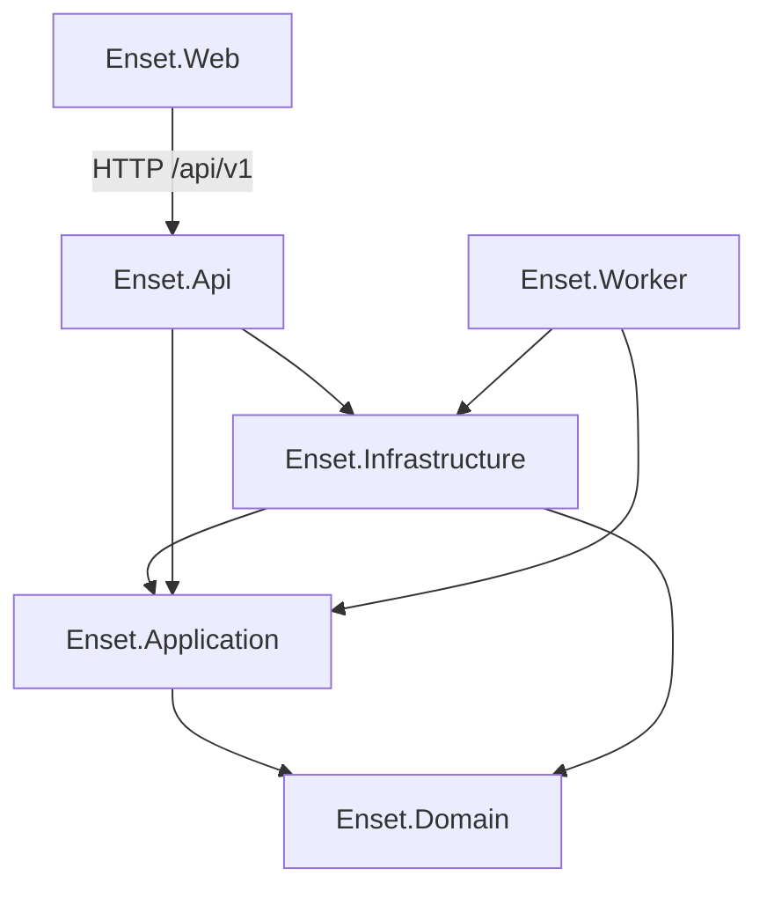

# ENSET Data Lake House – Architecture Review V1.3

**Reviewgegenstand:** implementierter Repository-Stand  
**Referenz:** `ARCHITECTURE_BASELINE_V2_0.md`  
**Reviewdatum:** 28. Juli 2026  
**Reviewart:** unabhängiges technisches Architektur-Audit  
**Gesamtstatus:** **Red**  
**Erfüllungsgrad gegenüber der Baseline:** **78 %**

## 1. Auftrag und Bewertungsmaßstab

Dieser Bericht bewertet ausschließlich den im Repository implementierten Stand
gegen die eingefrorene Architecture Baseline V2.0. Er plant keine neuen
Features und kritisiert keine ausdrücklich aus dem MVP ausgeschlossenen
Funktionen als fehlend.

Geprüft wurden:

- Domain-, Application-, Infrastructure-, API-, Worker- und Web-Projekte;
- Controller, DTOs, Services, Persistenzkonfiguration und Migrationen;
- Import-, CRUD-, Curation-, Gold- und Readiness-Pfade;
- Authentifizierung, Autorisierung, Mandantenscope und Fehlerbehandlung;
- vorhandene automatisierte Tests und ausführbare Qualitätsprüfungen;
- die Baseline selbst und ältere Dokumente nur zur Widerspruchserkennung.

Die Bewertung verwendet vier Konformitätsstufen:

| Status | Bedeutung |
|---|---|
| Green | Baseline im geprüften Umfang erfüllt; kein relevanter Releasebefund |
| Yellow | grundsätzlich umgesetzt, aber mit begrenzter Abweichung oder Risiko |
| Red | wesentliche Baselineaussage ist technisch nicht abgesichert oder falsch |
| N/A | bewusst nicht Teil des MVP und deshalb nicht negativ bewertet |

Der prozentuale Erfüllungsgrad ist eine Auditbewertung, keine
Code-Coverage-Metrik. Kernpfade wurden stärker gewichtet als Darstellung und
Dokumentationsdetails:

| Bewertungsblock | Gewicht | Erfüllung |
|---|---:|---:|
| Import und Datenpersistenz | 15 % | 13 % |
| CRUD, ReadModels, Audit, Soft Delete, Concurrency | 15 % | 13 % |
| Curation | 12 % | 10 % |
| Gold-Profile und Versionierung | 12 % | 8 % |
| Data Product Readiness | 12 % | 5 % |
| REST API, Sicherheit und Mandantenscope | 14 % | 11 % |
| Frontend | 10 % | 8 % |
| Tests, Wartbarkeit und Dokumentation | 10 % | 10 % |

Die Gesamtbewertung wird nicht als mathematisch exakte Produktmetrik
verwendet.

## 2. Executive Summary

Das Repository besitzt einen erkennbaren und weitgehend durchgängigen
MVP-Kern. Importanalyse und Commit sind getrennt, der Datenbankwriter arbeitet
transaktional, CRUD-Operationen besitzen ReadModels, Soft Delete, Audit und
`xmin`-Concurrency. Curation, Gold-Profil-Snapshots und eine Readiness-API sind
vertikal bis in das React-Frontend integriert. 168 Backendtests liefen im
Review erfolgreich.

Die Architektur ist jedoch **noch nicht releasefähig als MVP Version 1.0**.
Vier Befunde verhindern eine Freigabe:

1. Die Readiness-Engine prüft viele benannte fachliche Anforderungen nicht
   gegen den Snapshot. Sobald eine freigegebene Profilversion existiert,
   werden unter anderem Nutzung, Fläche, Region, Verbrauch, Energieträger,
   Zeitreihe und Vollständigkeit pauschal als erfüllt behandelt. Das ist eine
   versteckte Ersatzlogik und widerspricht der Baseline.
2. Echte Analytics- und Data-Product-Generation sind weiterhin als
   Controller, Services, Generatoren und UI-Verticals deploybar. Die Baseline
   deklariert diese als außerhalb des verbindlichen MVP, eine technische
   Systemgrenze schaltet sie aber nicht ab.
3. Der Restore meldet für `System.Security.Cryptography.Xml 9.0.15` mehrere
   bekannte Sicherheitslücken hohen Schweregrads. Ein Release mit bekannten
   High-Severity-Abhängigkeiten ist ohne dokumentierte Risikofreigabe nicht
   vertretbar.
4. Gold-Statusübergänge sind nicht als zulässiger Zustandsautomat validiert.
   Der Service kann über direkte API-Aufrufe auch nicht vorgesehene
   Übergänge, beispielsweise von `Revoked` zurück zu `Released`, ausführen.

Weitere wesentliche Risiken sind die dateibasierte ImportReport-Persistenz
ohne Retention und verteilte Synchronisation, fehlende automatisierte Tests
für Gold-Lifecycle, Readiness, echte PostgreSQL-Concurrency und Frontend sowie
die noch nicht rollenbasierte Navigation.

### 2.1 Gesamtbewertung

| Kriterium | Bewertung | Begründung |
|---|---|---|
| Gesamtzustand | Yellow/Red | funktionsfähiger Kern, aber Releaseblocker vorhanden |
| Architekturreife | Yellow | klare Schichten und Ports, mehrere unfertige Querschnittsregeln |
| MVP-Reife | Red | Readiness und Scope-Abgrenzung erfüllen den eingefrorenen Vertrag nicht |
| Implementierungsgrad | Yellow | Kernvertikale vorhanden, Qualität nicht überall abgesichert |
| Wartbarkeit | Yellow | gute Projektgrenzen, mehrere stark verdichtete Implementierungen |
| Erweiterbarkeit | Yellow | Ports und DTOs helfen; doppelte API-Sichten und Altverticals erschweren |
| Release-Eignung | Red | Sicherheits-, Semantik- und Zustandsrisiken vor Freigabe zu beheben |

## 3. Architekturkonformität

| Bereich | Status | Erfüllungsgrad | Bemerkung | Hauptrisiko |
|---|---|---:|---|---|
| Import | Yellow | 85 % | Analyse, Issues, Resolution, Write Gate und Commit vorhanden | JSON-Reports skalieren und koordinieren nicht |
| CRUD | Green | 90 % | zentrale Command-/Query-Handler und EF-Service | breite Serviceklasse, wenige Integrationsnachweise |
| ReadModels | Green | 90 % | paginierte Projektionen und Scope-Filter | komplexe Projektionen bei großen Datenmengen |
| Audit | Yellow | 85 % | CRUD, Import, Curation und Gold besitzen Nachweise | kein vollständiger End-to-End-Test |
| Soft Delete | Green | 90 % | globale Filter, Delete und Restore | Semantik `IsActive` plus `IsDeleted` bleibt teilweise doppelt |
| Concurrency | Yellow | 80 % | `xmin` und 409-Behandlung vorhanden | echte PostgreSQL-Konflikte kaum getestet |
| Bronze/Silver/Gold | Yellow | 85 % | als Reifestufen nachvollziehbar umgesetzt | Begriffe teils nur abgeleitet, keine harte Zonengrenze |
| Curation | Yellow | 85 % | Tasks, Regeln und Entscheidungen durchgängig | Evaluation scannt breiter als der angeforderte Scope |
| Gold Profile | Yellow | 75 % | typisierte Profile und Snapshot vorhanden | Lifecycle serverseitig unvollständig geschützt |
| Gold-Versionierung | Yellow | 70 % | Version, Hash, Events und `xmin` vorhanden | Übergänge und Parallelität unzureichend getestet |
| Readiness | Red | 40 % | API und Katalog vorhanden | zahlreiche Anforderungen sind Scheinerfüllungen |
| REST API | Yellow | 80 % | v1, DTOs, Policies und ProblemDetails | zwei Meter-Ressourcen und aktivierte Altendpunkte |
| Frontend | Yellow | 80 % | MVP-Vertikale sichtbar und servicebasiert | keine Tests, Fehler teils als „keine Daten“ maskiert |

## 4. Gesamtarchitektur und Schichtentrennung

Die Projektabhängigkeiten folgen überwiegend Clean Architecture:



Positiv sind die Application-Abstraktionen für Import, Authorization,
ReadModels und Data-Product-Generation. Infrastructure implementiert EF-,
Datei-, Excel- und CSV-Adapter. Das Frontend greift über Services auf die API
zu und enthält keine Kopie der Import- oder Readiness-Engine.

Die Umsetzung ist allerdings nur teilweise DDD-orientiert. Viele Entitäten
haben öffentliche Setter; wesentliche Invarianten und Statusübergänge liegen
in Infrastructure-Services statt in Aggregaten. Das ist für einen MVP
vertretbar, darf aber nicht als vollständige Aggregate-Kapselung bewertet
werden.

CQRS ist pragmatisch als getrennte Command- und Query-Handler ausgeführt.
Event Sourcing, Message Bus oder getrennte Stores sind nicht vorhanden und
werden von der Baseline auch nicht verlangt.

## 5. Domain Review

### 5.1 Kernobjekte

| Objekt | Konsistenz und Verantwortung | DDD-Bewertung | Status |
|---|---|---|---|
| Customer | fachliche Nummer, Kontakt, Adress- und Gebäudebeziehungen | tragfähige Entity, Invarianten überwiegend extern validiert | Green |
| Building | Stammdaten, Versionen und Customer-Zuordnung | umfangreiche Entity; Zustandssemantik verteilt | Yellow |
| MeteringPoint (`Meter`) | Zuordnung, Medium, Einheit, Richtung und Messwerte | technischer Klassenname weicht vom API-Begriff ab | Yellow |
| MeterReading | Zeit, Wert, Qualität, Herkunft und Importreferenz | fachlicher Schlüssel in DB abgesichert | Green |
| Document | Domain- und Scope-Modell vorhanden | kein vollständiges MVP-Frontend/CRUD-Vertical | Yellow |
| Import/ImportJob | Importlauf und Rohdatenbezug vorhanden | mehrere Importmodell-Ebenen sind erklärungsbedürftig | Yellow |
| ImportReport | Analysezustand, Vorschau, Issues und Audit | Application-Modell wird vollständig als JSON persistiert | Yellow |
| ImportIssue | Schwere, Typ, Auflösung und Herkunft | für Workflow ausreichend strukturiert | Green |
| CuratedFieldValue | Original-, kuratierter und normalisierter Wert mit Gültigkeit | gute Provenance-Trennung | Green |
| CurationTask/Decision | Vorschlag und Benutzerentscheidung | Lifecycle im Service abgesichert | Green |
| GoldProfileVersion/Event | Snapshot, Hash, Status und Ereignisse | Modell erlaubt unzulässige Übergänge außerhalb des Services | Yellow |
| DataProductReadiness | Ergebnisrecord, nicht persistiertes Aggregat | fachlich derzeit zu grob ausgewertet | Red |
| RequirementResult | Gewicht, Blocker, Reife und Guidance | gutes Contract-Modell, schwache Auswertungslogik | Yellow |

### 5.2 Abhängigkeiten

Die Kernentitäten sind frei von Infrastructure- und API-Abhängigkeiten.
Application kennt Domain und definiert Ports. Die Baseline wird damit
grundsätzlich erfüllt.

Abweichungen:

- Domain enthält zahlreiche Data-Product-, Marketplace-, Mobility-,
  EnergyCommunity- und Subscription-Modelle außerhalb des MVP-Kerns.
- `Meter` ist der Domainname, während UI und Teile der API `MeteringPoint`
  verwenden. Das ist funktional beherrschbar, erhöht aber Übersetzungsaufwand.
- `IsActive` und der geerbte Soft-Delete-Zustand können zwei ähnliche
  Aktivitätssemantiken ausdrücken.
- Gold-Lifecycle-Invarianten sind nicht im Domainmodell verankert.

## 6. Import Review

### 6.1 Funktionaler Pfad

CSV, Excel und LEB werden über Reader, Mapper, Validatoren und Coordinator
geführt. Analyse und Commit sind getrennt. Issues besitzen erlaubte
Resolutionen; Einzelentscheidungen und skalierbare Resolution Rules sind
implementiert. Das Write Gate verhindert den Commit bei offenen blockierenden
Issues.

`DatabaseImportWriter` schreibt Customer, Building, Zuordnungen, Meter,
`ImportedMeterReading` und kanonische `MeterReading` innerhalb einer
Datenbanktransaktion. `TargetMeteringPoint` wird über die vorhandene
Importpipeline aufgelöst; es existiert keine separate CSV-Schreibpipeline.

### 6.2 Positive Befunde

- Roh- und kanonische Messwerte bleiben unterscheidbar.
- Datenbank-Commit ist transaktional.
- Meter/Timestamp-Dubletten werden beim kanonischen Insert vermieden.
- Zeitstempel werden auf UTC normalisiert.
- CSV ohne Zeitspalte unterstützt Startzeit und Intervall.
- Import- und Resolutionverhalten ist der am stärksten getestete Bereich.

### 6.3 Abweichungen und Risiken

Der aktive `JsonImportReportRepository` serialisiert den vollständigen Report
mit eingerücktem JSON. Jeder Read/Write lädt beziehungsweise schreibt die
gesamte Datei. Ein pro Prozess globales `SemaphoreSlim` serialisiert alle
Reportzugriffe, schützt aber nicht zwischen mehreren API-Instanzen.

Im geprüften lokalen Release-Ausgabeverzeichnis lagen 80 Reportdateien mit
zusammen rund 3,9 GB; einzelne Dateien waren etwa 227 bis 267 MB groß. Das ist
ein gemessener Befund, keine Hochrechnung. Retention, Quota, Kompression,
inkrementelle Speicherung und eine Liste der Importhistorie sind im aktiven
Repository nicht vorhanden.

Der Datenbankwriter führt mehrere `SaveChangesAsync` innerhalb derselben
Transaktion aus. Das ist korrekt, erhöht bei großen Imports aber Roundtrips
und Change-Tracker-Last. Die Prüfung vorhandener Meter/Timestamp-Schlüssel
verwendet Mengen aller Meter-IDs und Timestamps und kann ein kartesisch
breites Datenbankprädikat erzeugen.

### 6.4 Importhistorie

Ein einzelner Report ist über seine ID abrufbar und enthält Audit-Einträge.
Eine paginierte, mandantensichere serverseitige Historienressource ist nicht
vorhanden. Das Frontend kann daher keine belastbare globale Importhistorie aus
dem aktiven Repository ableiten. Die Baseline sollte den Begriff
„Importhistorie“ entsprechend eng als Reportabruf verstehen.

## 7. CRUD, ReadModels, Soft Delete und Concurrency

CRUD für Customer, Building, MeteringPoint, MeterReading und EnergySystem ist
über gemeinsame Handler und einen EF-Service umgesetzt. Separate
Read-Projektionen liefern paginierte Listen und Details.

### 7.1 Soft Delete und Restore

`BaseEntity`-Typen erhalten globale Query Filter. Delete setzt
Löschmetadaten; Restore hebt sie auf. Abhängigkeitskonflikte werden als 409
ausgegeben. Die aktuelle React-Liste zeigt deaktivierte Customer, Buildings
und MeteringPoints nicht mehr an; Detailseiten behalten Restore-Aktionen für
direkt geladene deaktivierte Datensätze.

### 7.2 Concurrency

EF konfiguriert `RowVersion` als PostgreSQL-`xmin`. Update, Delete, Restore und
Gold-Statusänderungen übergeben den Token. `DbUpdateConcurrencyException`
wird als 409 ProblemDetails ausgegeben. Das Frontend zeigt einen verständlichen
Konflikt mit Neuladen/Abbrechen.

Die Tests prüfen vorwiegend Architektur, Validatoren und In-Memory-Verhalten.
Ein automatisierter Konflikttest gegen PostgreSQL und echte `xmin`-Änderungen
fehlt. Deshalb ist die Konformität plausibel, aber nicht releasefest
nachgewiesen.

### 7.3 Audit

CRUD-Auditdaten enthalten Entität, Aktion, Benutzer, Zeitpunkt, Herkunft und
Änderungen. Curation verwendet Decisions und CuratedFieldValue-Provenance;
Gold verwendet Events. ImportReports besitzen AuditEntries. Die Konzepte sind
vorhanden, jedoch nicht durch einen gemeinsamen End-to-End-Audittest über alle
MVP-Entitäten abgesichert.

## 8. Curation Review

Die Suggestion Engine ist deterministisch. Regeln tragen stabile RuleId,
RuleVersion, Confidence und Reasoning. Accept und Customize erzeugen eine
Decision und einen neuen aktuellen CuratedFieldValue; der vorherige Wert wird
mit `ValidToUtc` geschlossen. Reject erzeugt eine nachvollziehbare
Entscheidung, ohne den Vorschlag als Fachwert zu übernehmen.

### 8.1 Bewertung

| Kriterium | Status | Befund |
|---|---|---|
| Rules | Green | deterministische, lesbare Regeln |
| Suggestions | Green | Reasoning und Confidence vorhanden |
| Accept | Green | Decision und CuratedFieldValue |
| Customize | Green | eigener Wert plus Begründung |
| Reject | Green | Ablehnung bleibt nachvollziehbar |
| Audit | Yellow | fachliche Historie vorhanden, wenige End-to-End-Tests |
| Provenance | Green | Original, Quelle, Regel, Import und Benutzer |
| Versionierung | Yellow | RuleVersion vorhanden, kein Regelkatalog-Lifecycle |

### 8.2 Risiko der Evaluation

`EvaluateBuildingAsync` und `EvaluateMeteringPointAsync` prüfen zuerst den
angefragten Scope, rufen anschließend aber die allgemeine
`DiscoverTasksAsync`-Routine auf und ermitteln die Differenz über die globale
Taskanzahl. Eine objektbezogene API-Aktion kann dadurch breitere Discovery-
Arbeit auslösen als ihr Name erwarten lässt. Das ist kein Datenleck, weil der
Service Scopefilter nutzt, aber ein Performance- und Verständlichkeitsrisiko.

## 9. Gold Profile Review

BuildingGoldProfile und MeteringPointGoldProfile sind typisierte,
serialisierbare Contracts. Der Snapshot wird als camelCase-JSON gespeichert;
SHA-256 wird über exakt diese JSON-Darstellung gebildet. Technische
Versionsmetadaten liegen außerhalb des Snapshot-JSON. Die vorhandenen
Hash-Unit-Tests belegen Determinismus für einfache Testobjekte und eine
Hashänderung bei fachlicher Änderung.

### 9.1 Reproduzierbarkeit

Die Profilrecords enthalten keine Erstellungszeit und keine zufälligen Werte.
Der vom VersionService serialisierte Inhalt ist daher grundsätzlich
reproduzierbar. Die Baselineaussage zur Hashbildung ist erfüllt.

### 9.2 Lifecycle

Folgende Statuswerte existieren:

- Draft
- Released
- Superseded
- Revoked

Beim Release wird Gold-Readiness geprüft und eine bisher freigegebene Version
auf Superseded gesetzt. Revoke speichert einen Grund. Events halten vorherigen
und neuen Status sowie den SnapshotHash.

Der Service validiert jedoch keine erlaubte Transition. `Change` setzt das
Ziel direkt. Die UI bietet nur Draft→Released und Released→Revoked an, aber
direkte API-Aufrufe können beispielsweise Revoked→Released,
Superseded→Released oder Draft→Revoked durchführen. Die UI ist keine
Sicherheits- oder Domaininvariante.

Zusätzlich bestehen keine gezielten Tests für:

- Versionserhöhung und identischen Hash;
- parallele Snapshot-Erstellung;
- Supersede mehrerer Versionen;
- sämtliche erlaubten und verbotenen Übergänge;
- Revoke-Grund;
- `xmin`-Konflikte;
- Eventvollständigkeit.

### 9.3 Concurrency

Der Zielversion wird die übergebene RowVersion als Originalwert gesetzt.
Mitbetroffene ältere Released-Versionen verwenden die beim Laden erhaltene
RowVersion. Das ist grundsätzlich optimistisch abgesichert. Parallel erzeugte
neue Versionen verlassen sich zusätzlich auf Datenbankindizes; das Verhalten
bei konkurrierender Versionserstellung ist nicht automatisiert geprüft.

## 10. Data Product Readiness Review

### 10.1 Vorhandene Struktur

Die Engine unterstützt:

- Building Benchmark;
- Energy Benchmark;
- Normalized Load Profile;
- Normalized Generation Profile;
- EEG Matching;
- Peer-to-Peer Analysis.

RequirementResult enthält ID, Name, Beschreibung, Gewicht, Blocking-Flag,
Mindestmaturity, Erfüllung und Guidance. Der Prozentwert ist gewichtet;
unerfüllte Blocker führen zu `NotReady`. EEG/P2P halten Netz-, Überlappungs-
und Tarifanforderungen bewusst auf unerfüllt.

### 10.2 Kritische Abweichung

Für den Großteil des Katalogs wird `Fulfilled` nicht aus `SnapshotJson`
ermittelt. Die Variable `has` bedeutet lediglich, dass irgendeine Released-
Version existiert. Derselbe boolesche Wert erfüllt danach pauschal:

- Usage;
- Heated Area;
- Postal Code;
- Consumption;
- Benchmark State;
- Energy Carrier;
- Time Series;
- Completeness.

Nur HWB sowie bewusst noch nicht implementierte EEG/P2P-Voraussetzungen werden
anders behandelt. Ein Released-Snapshot mit fehlender Fläche oder
unvollständiger Zeitreihe kann deshalb eine fachlich unzutreffend hohe
Readiness erhalten.

Das ist eine versteckte Dummy-/Proxybewertung. Sie verletzt die eingefrorenen
Prinzipien „deterministische Requirement-Prüfung“, „konkrete Blocker“ und
„Readiness vor Berechnung“. Sie gefährdet zwar noch keine Data-Product-
Berechnung im MVP, aber die Readiness selbst ist ein zugesagtes MVP-Ergebnis.

### 10.3 Readiness ist nicht Berechnung

Die Readiness-API erzeugt keine Benchmarks, normalisiert keine Lastprofile und
führt kein EEG/P2P-Matching aus. Diese Trennung ist im Readiness-Service
eingehalten. Separat vorhandene Data-Product-Generatoren ändern diesen Befund
für die Engine nicht, stellen aber eine Systemgrenzenabweichung dar.

## 11. API Review

### 11.1 Positive Befunde

- konsistente Basis `/api/v1`;
- Controller verwenden Request-/Response-DTOs oder Application-Contracts;
- JWT-Authentifizierung mit Issuer, Audience, Signatur und Lifetime;
- Policies für Employee, Admin und Customer-Rollen;
- Objektzugriff über `IDataAccessScope`;
- RFC-7807 ProblemDetails über zentralen ExceptionHandler;
- Pagination für zentrale Listen;
- 409 für fachliche und Concurrency-Konflikte.

### 11.2 Abweichungen

`/meters` stellt Lese- und Aggregationsendpunkte bereit,
`/metering-points` das CRUD. Zwei Ressourcen repräsentieren dieselbe Entität.
Das ist dokumentiert, aber für API-Konsumenten unnötig inkonsistent.

Gold- und Readiness-Controller sind ausschließlich für EnsetEmployee
autorisiert. Der zusätzliche Objektscope ist damit defensiv, erlaubt aber
Customer-Rollen keinen Zugriff auf die im Objektfrontend eingebetteten
Panels. Ob dies fachlich beabsichtigt ist, ist in der Baseline nicht präzise
festgelegt.

Unbekannte `scopeType`-Werte werden in der Readiness-Engine stillschweigend
als Building interpretiert. Unbekannte Gold-`entityType`-Werte führen
ebenfalls nur über die Sichtbarkeitsprüfung zu „nicht gefunden“. Eine
explizite 400-Validierung wäre für einen stabilen API-Vertrag erforderlich.

Die Baseline schließt eigentliche Data Products aus dem verbindlichen MVP aus,
aber `/analytics/*` und `/data-products/*` werden mit der API kompiliert und
registriert. Es gibt keinen Feature-Schalter oder Deploymentzuschnitt, der
die Grenze erzwingt.

### 11.3 ProblemDetails und Statuscodes

CRUD- und Curation-Exceptions werden zentral korrekt auf 400, 404 und 409
abgebildet. Unbekannte Exceptions werden in Produktion ohne internen
Stacktrace als 500 ausgegeben. In Development werden Exceptiondetails
erweitert, was angemessen ist.

Die Controller dokumentieren ResponseTypes uneinheitlich. Swagger kann
deshalb nicht für jeden Endpunkt alle tatsächlich möglichen ProblemDetails
vollständig ableiten.

## 12. Mandantensicht und Sicherheit

`EfDataAccessScope` filtert Customer, Building, Meter, MeterReading, Document
und DataProduct anhand aktiver, zeitlich gültiger UserCustomerAssignments.
Nicht sichtbare Objekte werden als nicht gefunden behandelt. Schreibrechte
erfordern CustomerAdmin oder CustomerUser; globale EnsetEmployee werden
zugelassen.

### 12.1 Stärken

- JWT-Konfiguration scheitert früh bei fehlendem Issuer, Audience oder zu
  kurzem Signing Key.
- API-Policies und Objektscope sind getrennte Schutzebenen.
- DTOs verhindern direktes Overposting von Audit- und Herkunftsfeldern.
- Soft Delete löscht keine fachlichen Daten physisch.
- RowVersion schützt konkurrierende Änderungen.
- ProblemDetails verbirgt Produktionsdetails.

### 12.2 Releasebefunde

Der Restore meldete für `System.Security.Cryptography.Xml 9.0.15` mehrere
NU1903-Warnungen mit bekannten Schwachstellen hohen Schweregrads. Betroffen
sind Infrastructure und das Testprojekt. Unabhängig davon, ob jeder
verwundbare Codepfad im MVP erreichbar ist, muss vor Release aktualisiert,
entfernt oder formal risikobewertet werden.

Die React-Navigation setzt die Adminsichtbarkeit weiterhin fest auf `true`.
Die API verhindert dadurch zwar unberechtigte Operationen, aber Benutzer
sehen Funktionen, die sie nicht ausführen dürfen. Das erzeugt Fehlversuche und
offenbart unnötig administrative Oberflächen.

Gold-Lifecycle-Regeln sind nur über die angebotenen UI-Buttons eingeschränkt.
Manipulationsschutz muss serverseitig gelten; dieser ist für Transitionen
unvollständig.

Uploadgrößen-, Dateiquota- und Retentiongrenzen sind im geprüften
Importpfad nicht als belastbares Gesamtkonzept erkennbar. Zusammen mit sehr
großen JSON-Reports entsteht ein Verfügbarkeitsrisiko.

## 13. Frontend Review

### 13.1 Funktionsumfang

| Bereich | Status | Bewertung |
|---|---|---|
| Dashboard | implementiert | fachlich einfache Übersicht |
| Import | implementiert | Analyse, Resolution, Readiness und Commit durchgängig |
| Customer | implementiert | Liste, Detail, Formulare, Audit, Delete/Restore |
| Building/Objekt | implementiert | Stammdaten, Beziehungen, Reife und Aktionen |
| Meter/Zählpunkt | implementiert | Stammdaten, Readings, Import und Reife |
| Data Curation | implementiert | Aufgaben, Filter, Detail und Decisions |
| Gold Profiles | implementiert | Create, Release, Revoke und Historie |
| Readiness | implementiert | Curation- und Data-Product-Panels |
| Navigation | teilweise konform | Adminsichtbarkeit nicht rollenbasiert |

### 13.2 UX und fachliche Verständlichkeit

Die sichtbaren Begriffe „Objekt“ und „Zählpunkt“ sind fachlich verständlich.
Create/Edit verwenden Auswahlfelder statt GUID-Eingaben. Dirty-State-Warnung,
409-Meldung, Abbrechen sowie Audit- und Soft-Delete-Aktionen sind vorhanden.
API-Aufrufe liegen überwiegend in Services oder abgegrenzten Feature-
Komponenten.

Relevante Schwächen:

- `DataProductReadinessPanel` wandelt jeden Ladefehler in eine leere Liste um.
  401, 403, 404 und 500 erscheinen damit gleich als „Keine Readiness
  verfügbar“.
- Einige Gold- und Curation-Komponenten sind stark komprimiert in
  Einzeilenformat geschrieben. Das erschwert Review und Wartung.
- Gold zeigt die technische `createdByUserId` statt eines Benutzernamens.
- Status-, Maturity- und Requirement-Begriffe sind teilweise nicht lokalisiert.
- Es existieren keine automatisierten Komponenten-, Routing- oder E2E-Tests.

Designästhetik wurde nicht bewertet.

## 14. Codequalität

### 14.1 Stärken

- nachvollziehbare Projektstruktur;
- Domain ohne Frameworkabhängigkeit;
- Application-Ports für wesentliche Workflowgrenzen;
- zentrale API-Fehlerbehandlung;
- gemeinsame CRUD- und ReadModel-Infrastruktur;
- TypeScript mit erfolgreichem striktem Build;
- deterministische fachliche Regeln statt KI-Blackbox;
- überwiegend sprechende Typen und Contracts.

### 14.2 Technische Schulden

Mehrere neuere Services und React-Komponenten sind extrem verdichtet
formatiert. Besonders `GoldProfileServices.cs`,
`GoldProfileVersionsPanel.tsx`, `DataProductReadinessPanel.tsx` und Teile des
Curation-Centers vereinen viele Verantwortlichkeiten auf sehr wenigen
physischen Zeilen. Das senkt Lesbarkeit und erhöht Merge- und Reviewrisiko.

`EfEntityCrudService`, `EfEntityReadService` und `EfCurationService` bedienen
mehrere Aggregate. Die gemeinsame Implementierung reduziert Duplikation,
führt aber zu großen Klassen und erschwert isolierte Änderungstests.

Es gibt keine Solution-Datei im Repositoryroot. Ein normales `dotnet test`
vom Root scheitert deshalb mit MSB1003. Außerdem ist kein CI-Workflow im
Repository vorhanden. Reproduzierbare Releaseprüfungen sind damit nicht
automatisch erzwungen.

## 15. Testabdeckung

### 15.1 Ausgeführter Stand

Der Testlauf über
`tests/Enset.Import.Tests/Enset.Import.Tests.csproj` bestand:

```text
168 bestanden
0 fehlgeschlagen
0 übersprungen
```

Ein erster Standardlauf wurde durch eine laufende API blockiert, die DLLs im
normalen Buildverzeichnis sperrte. Der erfolgreiche Lauf verwendete deshalb
ein separates temporäres Outputverzeichnis. Beim Kopieren vorhandener
App_Data-ImportReports traten zusätzlich Speicherplatzwarnungen auf; die
Tests selbst bestanden.

Frontend:

```text
npm run lint   erfolgreich
npm run build  erfolgreich
```

Das Frontend definiert keinen Test-Task.

### 15.2 Abdeckung nach Bereich

| Bereich | Automatisierter Nachweis | Bewertung |
|---|---|---|
| CSV/Excel/LEB Import | umfangreiche Unit-/Integrationstests | Green |
| Issues und Resolution Rules | umfangreich | Green |
| Commit Readiness/Write Gate | umfangreich | Green |
| Raw-/Curated-Reading-Persistenz | vorhanden, überwiegend InMemory | Yellow |
| Authorization-Architektur | Policy-/Strukturtests vorhanden | Yellow |
| CRUD | Validator- und Foundationtests | Yellow |
| Curation Maturity/Rules | Unit-Tests vorhanden | Yellow |
| Curation Decisions/Provenance mit DB | kaum abgedeckt | Red |
| Gold Hash | zwei einfache Unit-Tests | Yellow |
| Gold Lifecycle/Events/Concurrency | nicht gezielt getestet | Red |
| Data Product Readiness | keine gezielten Tests | Red |
| PostgreSQL `xmin` | kein echter Konflikttest | Red |
| API ProblemDetails und Mandantentrennung | keine vollständigen Hosttests | Red |
| React-Komponenten und E2E | nicht vorhanden | Red |

Die Testsuite enthält weiterhin mehrere Tests für ältere Analytics- und
Data-Product-Generation. Diese erhöhen die Testzahl, sichern aber nicht die
offenen MVP-Kernrisiken ab.

## 16. Performance und Skalierbarkeit

| Bereich | Befund | Risiko |
|---|---|---|
| ReadModels | Projektionen, `AsNoTracking`, Filter und Pagination | gute Basis; komplexe Counts bei großen Beständen beobachten |
| Importanalyse | Report hält Preview, Issues und DTOs | hoher Speicherbedarf bei großen Dateien |
| ImportReport | vollständige eingerückte JSON-Datei pro Save/Load | I/O, Speicher, Plattenwachstum, keine Multi-Node-Sicherheit |
| Importwriter | Transaktion und Batch-ähnliche Vorabfragen | Change Tracker und große `IN`-Mengen |
| Curation Discovery | breite Suche bei objektbezogener Evaluate-Aktion | Laufzeit wächst mit sichtbarem Bestand |
| Readiness All | sechs sequenzielle Evaluierungen; jede lädt Versionsliste | mehrere redundante DB-Abfragen pro Scope |
| Gold Snapshot | vollständiges JSON plus SHA-256 | für Einzelprofile vertretbar |
| Gold Versions | paginiert nicht | langfristig wachsende Historie je Entity |
| Zeitreihen ReadModel | Aggregation in API/EF-Pfad | keine produktionsreife Timeseries Engine; große Zeiträume begrenzen |

Die Baseline bezeichnet ausdrücklich keine produktionsreife Time Series
Engine. Dieser fehlende Ausbau ist kein MVP-Mangel. Release-relevant bleibt
jedoch, dass vorhandene Meter-Reading-Endpunkte keine klar dokumentierten
Maximalzeiträume oder Lasttests besitzen.

## 17. Dokumentationsreview

### 17.1 Vollständigkeit und Aktualität

Architecture Baseline V2.0 ist deutlich näher am Code als die historischen
Dokumente. Sie beschreibt die aktiven MVP-Vertikale, nennt den JSON-
ImportReport-Adapter, die geteilte Meter-API, Navigationseinschränkungen und
ältere Analytics/Data-Product-Verticals.

Diagramme, Schichten und Begriffe sind überwiegend konsistent. Bronze, Silver
und Gold werden korrekt als fachliche Reifestufen und nicht als physisch
getrennte Lake-Zonen dargestellt.

### 17.2 Korrekturbedarf der Baseline

Folgende Aussagen sind zu stark:

- Der Requirement-Katalog wird beschrieben, als prüfe er konkrete Snapshot-
  Voraussetzungen. Tatsächlich prüft er überwiegend nur das Vorhandensein
  einer Released-Version.
- Gold-Versionierung wird als Zustandsdiagramm mit definierten Übergängen
  dargestellt; der Server erzwingt diese Übergänge nicht vollständig.
- „Bereitstellung hochwertiger Data Products“ ist als Ziel verständlich,
  tatsächlich endet der MVP bei Readiness. Vorhandene Generatoren müssen als
  Altvertical technisch klarer abgegrenzt werden.
- ImportReport-Persistenz wird korrekt als JSON benannt, ihr gemessener
  Größen- und Retentionseffekt aber nicht als Betriebsgrenze ausgewiesen.
- Die Frontendbeschreibung nennt Navigation als Inkonsistenz, nicht aber das
  Maskieren von Readiness-Fehlern.

Die Baseline bleibt als Referenz verwendbar, benötigt nach Behebung oder
formaler Akzeptanz dieser Befunde eine punktuelle Aktualisierung. Historische
Dokumente müssen dafür nicht überschrieben werden.

## 18. MVP-Abgrenzung

### 18.1 Nicht als fehlend bewertet

Folgende Themen sind korrekt außerhalb des verbindlichen MVP und werden nicht
für ihre fehlende produktionsreife Umsetzung kritisiert:

- Asset Layer;
- Grid Layer;
- Time Series Engine;
- Benchmark Engine und Benchmarkberechnung;
- Lastprofilnormalisierung;
- EEG Matching;
- Peer-to-Peer-Berechnung;
- Tarifverwaltung;
- Transformatoren und Netzebenen;
- Netzmodell;
- Anonymisierung;
- Customer Aggregation;
- Region Aggregation;
- produktionsreife Data Products;
- KI-gestützte Regeln.

### 18.2 Tatsächliche Abgrenzungsabweichung

Das Problem ist nicht, dass diese Funktionen fehlen. Das Problem ist, dass
Teile echter Analytics- und Data-Product-Berechnung bereits im gleichen
deploybaren Artefakt liegen:

- `AnalyticsController`;
- `DataProductsController`;
- Generation Commands und Handler;
- BuildingEnergyProfile- und MeterConsumptionSummary-Generatoren;
- Repositories und Persistenzmodelle;
- sichtbare Frontendnavigation und Seiten;
- eigene Tests.

Die Baseline bezeichnet sie als ältere Verticals außerhalb des Vertrags.
Architektonisch ist diese Grenze aber nur dokumentarisch. Für ein eindeutiges
MVP-Artefakt müssen diese Endpunkte vor Release entweder deaktiviert oder
explizit als freigegebener Scope behandelt werden. Eine neue Funktion ist
dazu nicht erforderlich; es geht um die Releasekonfiguration.

## 19. Risikoregister

| Risiko | Auswirkung | Wahrscheinlichkeit | Priorität | Empfehlung |
|---|---|---|---|---|
| Readiness meldet nicht geprüfte Voraussetzungen als erfüllt | falsche Freigabeentscheidung | hoch | P0 | Requirements gegen Snapshotwerte auswerten und testen |
| bekannte High-Severity-Paketlücken | Sicherheits- und Compliance-Risiko | mittel | P0 | Paket aktualisieren/entfernen oder formale Ausnahme |
| unzulässige Gold-Statusübergänge | inkonsistente Versionen und Auditkette | mittel | P0 | Transition-Matrix serverseitig erzwingen |
| deploybare Data-Product-Altverticals | unklare MVP-Grenze, unbeabsichtigte Nutzung | mittel | P0 | aus MVP-Deployment entfernen oder abschalten |
| sehr große JSON-ImportReports ohne Retention | Plattenfüllung und API-Ausfall | hoch | P0 | Releasegrenzen, Retention und Betriebsmonitoring festlegen |
| Semaphore schützt nur eine API-Instanz | verlorene/überschriebene Reportupdates | mittel | P1 | Single-Instance als Grenze dokumentieren oder Store ändern |
| fehlende Gold-/Readiness-/Concurrency-Tests | Regressionen in Freigabepfaden | hoch | P1 | gezielte PostgreSQL- und Servicetests ergänzen |
| keine Frontendtests | unerkannte Workflowregressionen | mittel | P1 | kritische MVP-Flows automatisieren |
| Readiness-UI maskiert API-Fehler | Benutzer trifft Entscheidungen ohne Fehlerkontext | hoch | P1 | Fehlerzustände differenziert anzeigen |
| Adminnavigation für alle sichtbar | Fehlversuche und unnötige Offenlegung | hoch | P1 | Navigation aus echten Claims ableiten |
| keine Root-Solution und kein CI | Releaseprüfung nicht reproduzierbar | mittel | P1 | verbindlichen Build-/Testentrypoint schaffen |
| zwei Meter-API-Ressourcen | Integrations- und Wartungsaufwand | mittel | P2 | Vertrag dokumentieren, später konsolidieren |
| breite Curation Discovery | unnötige DB-Last | mittel | P2 | Evaluation auf Zielscope begrenzen |
| unpaginierte Gold-Historie | wachsender Payload | niedrig | P2 | bei realem Wachstum paginieren |

## 20. Empfehlungen

### 20.1 Vor MVP Release

1. Readiness-Anforderungen aus dem gespeicherten Snapshot beziehungsweise
   verifizierbaren Profildaten ermitteln; jeden Requirement-Typ testen.
2. Gold-Transitionen serverseitig auf die freigegebene Matrix begrenzen und
   Lifecycle-, Event- und Concurrency-Tests ergänzen.
3. NuGet-Sicherheitswarnungen beseitigen oder mit nachvollziehbarer
   Risikobewertung formell freigeben.
4. Analytics- und Data-Product-Generation im MVP-Artefakt technisch
   deaktivieren oder die Baseline und Freigabegrenze bewusst ändern.
5. Eine betriebliche Grenze für Importgröße und ImportReport-Speicher
   definieren; vorhandenes Plattenwachstum, Retention und Monitoring klären.
6. Mindestens Mandantentrennung, ProblemDetails, PostgreSQL-`xmin`,
   Gold-Release und Readiness als API-/Integrationstests ausführen.
7. Readiness-Fehler im Frontend sichtbar machen und Navigation aus Rollen
   ableiten.
8. Einen reproduzierbaren Root-Build/Testentrypoint und CI-Releasegate
   etablieren.

### 20.2 Kurz nach MVP

1. `/meters` und `/metering-points` vertraglich konsolidieren.
2. Curation Discovery auf den angeforderten Scope begrenzen.
3. Gold-Versionslisten paginieren, wenn reale Historien wachsen.
4. große Services und verdichtete React-Komponenten strukturieren und
   formatieren.
5. Frontend-Komponenten- und E2E-Tests für Import, CRUD, Curation und Gold
   ausbauen.
6. Audit-Vollständigkeit über Entitätsgrenzen automatisiert prüfen.

### 20.3 Data Products V2

Erst nach stabiler MVP-Freigabe:

- Asset- und Grid-Layer als eigene fachliche Module;
- produktionsreife Time Series Engine;
- Benchmark Engine;
- normalisierte Last- und Erzeugungsprofile;
- EEG- und P2P-Berechnung;
- Tarif-, Transformator-, Netzebenen- und Netzmodelle;
- Anonymisierung und Aggregationen;
- klare Trennung zwischen Readiness, Generation und veröffentlichtem
  Data Product.

Diese Empfehlungen sind keine Erweiterung des MVP.

## 21. Releasebewertung

**Nein**

Das ENSET Data Lake House ist im geprüften Stand nicht als MVP Version 1.0
architektonisch releasefähig. Der Kern ist weit fortgeschritten und die
Mehrheit der Baseline ist umgesetzt. Die Readiness-Engine liefert jedoch für
mehrere Anforderungen nicht nachgewiesene Erfüllungen, der Gold-Lifecycle ist
serverseitig nicht vollständig geschützt, bekannte High-Severity-
Abhängigkeiten bleiben offen und die dokumentierte MVP-Grenze wird im
deploybaren API-Artefakt nicht technisch eingehalten. Zusätzlich erzeugt der
aktive ImportReport-Store bereits einen konkreten Betriebsengpass.

Die Bewertung kann nach Behebung der P0-Punkte ohne Architektur-Neuentwurf
erneut durchgeführt werden.

## 22. Architecture Review Summary

### 22.1 Gesamtbewertung

**Red, 78 % Baseline-Erfüllung.**

Die Architektur besitzt einen belastbaren MVP-Kern, aber noch keine
freigabefähige Kombination aus korrekter Readiness, geschütztem
Gold-Lifecycle, sicherem Dependency-Stand und eindeutiger Deploymentgrenze.

### 22.2 Stärken

- klare Projekt- und Schichtentrennung;
- transaktionaler Importwriter und explizites Write Gate;
- umfangreich getestete Import- und Resolutionlogik;
- zentrale CRUD-, ReadModel-, Audit- und Concurrency-Grundlagen;
- mandantenbezogene Scopefilter zusätzlich zu API-Policies;
- deterministische Curation mit Confidence, RuleVersion und Provenance;
- typisierte Gold-Profile, gespeicherte Snapshots und SHA-256;
- durchgängige React-Vertikale für die MVP-Kernbereiche;
- 168 erfolgreiche Backendtests sowie erfolgreicher Frontend-Lint und Build.

### 22.3 Schwächen

- Readiness-Katalog wertet fachliche Inhalte überwiegend nicht aus;
- Gold-Zustandsautomat ist nur in der UI, nicht vollständig im Server;
- Altverticals verwischen die eingefrorene MVP-Grenze;
- dateibasierte ImportReports wachsen stark und sind nicht Multi-Node-fähig;
- zentrale Freigabepfade sind unzureichend automatisiert getestet;
- bekannte verwundbare Paketversion;
- rollenunabhängige Navigation und maskierte Readiness-Fehler;
- kein CI und kein Root-Testentrypoint.

### 22.4 Offene Punkte

**Kritisch:**

1. Readiness-Scheinerfüllungen.
2. High-Severity-Dependency-Warnungen.
3. ungeschützte Gold-Transitionen.
4. nicht technisch abgegrenzte Data-Product-Generation.
5. ImportReport-Speicherwachstum ohne Betriebsgrenzen.

**Mittel:**

1. fehlende Integrationstests für PostgreSQL, Mandantenscope und API.
2. keine Frontendtests.
3. UI-Fehlermaskierung und Navigation.
4. Single-Process-Synchronisation des JSON-Stores.
5. fehlender automatischer Releaseworkflow.

**Geringfügig:**

1. geteilte Meter-/MeteringPoint-Ressourcen.
2. verdichtete Formatierung einzelner Services und Komponenten.
3. technische Benutzer-IDs und nicht lokalisierte Statuswerte in der UI.
4. unpaginierte Gold-Historie bei künftigem Wachstum.

### 22.5 Releaseempfehlung

Kein MVP-Release im aktuellen Stand. Nach Behebung der P0-Risiken und
erfolgreichen gezielten Regressionstests ist ein erneutes, auf diese Befunde
begrenztes Release-Audit ausreichend; ein vollständiger Architekturentwurf
ist nicht notwendig.
