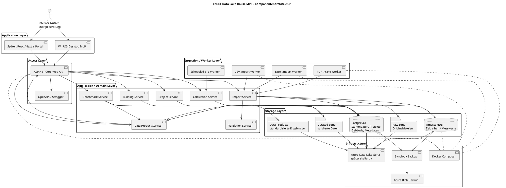

# Architekturüberblick

Die aktuelle Repository-Implementierung umfasst den technischen Kern des ENSET Data Lake House MVP.

Der Fokus liegt auf der Datenaufnahme, Datenverwaltung, Datenverarbeitung, Datenanalyse sowie der Bereitstellung standardisierter Data Products für die Business Modules des ENSET Universe.

Die aktuelle Implementierung konzentriert sich auf die Backend-Komponenten (Domain, Application und Infrastructure). Geplante Komponenten wie Benutzeroberflächen, Web API und Worker sind im Architekturdiagramm beschrieben und werden schrittweise im Rahmen des MVP umgesetzt.

Das ENSET Data Lake House dient dabei nicht ausschließlich der Speicherung energierelevanter Daten. Seine Hauptaufgabe besteht darin, aus heterogenen Datenquellen qualitätsgesicherte und standardisierte Data Products bereitzustellen, welche von der ENSET Data Platform sowie zukünftigen Business Modules genutzt werden.

'--------------------------------------------------------------------------------------
'DATA FLOW
'--------------------------------------------------------------------------------------
@startuml
title ENSET Data Lake House MVP - Datenfluss

actor "Energieberater" as User

participant "UI\nWinUI3/Blazor/React" as UI
participant "ASP.NET Core API" as API
participant "Import Service" as Import
participant "Validation Service" as Validation
database "PostgreSQL" as PG
database "TimescaleDB" as TS
collections "Raw Zone" as Raw
collections "Curated Zone" as Curated
participant "Calculation Service" as Calc
participant "Benchmark Service" as Bench
participant "Data Product Service" as Product
collections "Data Products" as Products

User -> UI: Projekt/Gebäude anlegen
UI -> API: POST /projects, /buildings
API -> PG: Stammdaten speichern

User -> UI: Datei importieren
UI -> API: POST /imports/files
API -> Import: ImportJob erstellen
Import -> Raw: Originaldatei speichern
Import -> Validation: Daten prüfen und normalisieren

Validation -> PG: Metadaten speichern
Validation -> TS: Messwerte speichern

Calc -> TS: Messdaten lesen
Calc -> PG: Gebäudedaten lesen
Calc -> Curated: Kennzahlen speichern

Bench -> Curated: Kennzahlen lesen
Bench -> PG: Vergleichsgruppen lesen

Curated -> Product: Datenbasis bereitstellen
Bench -> Product: Benchmark-Ergebnisse bereitstellen
Product -> Products: Standardisierte Data Products erzeugen

Products -> API: Data Products bereitstellen
API -> UI: Dashboarddaten / Auswertungen
UI -> User: Auswertung anzeigen

@enduml

'--------------------------------------------------------------------------------------
'DATA PRODUCT LAYER / MARKETPLACE EXTENSION
'--------------------------------------------------------------------------------------
@startuml
title ENSET Data Lake House - Data Product Layer und Marketplace-Erweiterung

package "Data Lake House" {
  [Raw Data]
  [Processed Data]
  [KPI / Benchmark Engine]
}

package "Data Product Layer" {
  [Quality Assurance]
  [Aggregation Service]
  [Anonymization Service]
  [Metadata Catalog]
  [Data Product Service]
  [Export Service]
  [Pricing Service]
}

package "Business Modules" {
  [Municipal Building Platform]
  [Energy Management]
  [Reporting]
  [Benchmarking]
}

package "Marketplace / Data Space Extension" {
  [Marketplace API]
  [Download / Purchase API]
  [Data Space Connector]
}

[Processed Data] --> [Quality Assurance]
[KPI / Benchmark Engine] --> [Quality Assurance]

[Quality Assurance] --> [Aggregation Service]
[Aggregation Service] --> [Anonymization Service]
[Anonymization Service] --> [Metadata Catalog]
[Metadata Catalog] --> [Data Product Service]

[Data Product Service] --> [Municipal Building Platform]
[Data Product Service] --> [Energy Management]
[Data Product Service] --> [Reporting]
[Data Product Service] --> [Benchmarking]

[Data Product Service] --> [Export Service]
[Data Product Service] --> [Pricing Service]

[Export Service] --> [Marketplace API]
[Marketplace API] --> [Download / Purchase API]
[Export Service] --> [Data Space Connector]

@enduml

# Aktuelle Projektstruktur

Die Implementierung wurde sauber nach Clean Architecture aufgeteilt:

- `src/Enset.Domain/`
  - Enthält ausschließlich Domain-Entities, Enums und reine Business-Logik.
  - Keine Abhängigkeit auf EF Core, Infrastructure oder Application.
  - Packages: `Common`, `Customers`, `Projects`, `Buildings`, `Energy`, `Documents`, `Analytics`, `Geography`, `Data`.

- `src/Enset.Application/`
  - Referenziert `Enset.Domain`.
  - Enthält Import-DTOs, Abstraktionen, Enums und Prozessmodelle.
  - Packages: `Imports/DTOs`, `Imports/Abstractions`, `Imports/Enums`, `Imports/Models`.

- `src/Enset.Infrastructure/`
  - Referenziert `Enset.Domain` und `Enset.Application`.
  - Enthält EF Core `EnsetDbContext`, TimescaleDB-/PostgreSQL-Persistenz, Reader-Implementierungen, Mapper-Implementierungen und konkrete Services.
  - Importlogik und Datenzugriff sind hier implementiert.

## Wichtige Punkte

- `MeterReading` ist ein Domain-Zeitreihenobjekt und erbt nicht von `BaseEntity`.
- `MeterReading` verwendet den Composite Key `MeterId + Timestamp`.
- `Meter` erbt von `BaseEntity` und verwendet `MeterNumber` als fachliche Identität.
- `MeterId` bleibt die technische interne GUID.
- Import-Dateien arbeiten mit `MeterNumber`, nicht mit der internen `MeterId`.
- `EnsetDbContext` liegt ausschließlich in `src/Enset.Infrastructure/DBContext.cs`.
- `ImportJob` und `DataSource` sind aktuell nicht als `DbSet` im DbContext enthalten.

## Architekturprinzip

Das ENSET Data Lake House dient nicht ausschließlich der Speicherung energierelevanter Daten.

Sein primärer Zweck besteht darin, aus unterschiedlichsten Datenquellen standardisierte, qualitätsgesicherte und wiederverwendbare Data Products bereitzustellen.

Business Modules wie die Municipal Building Platform, das Energy Management oder zukünftige Anwendungen greifen ausschließlich auf diese Data Products zu und nicht direkt auf Rohdaten oder interne Speicherstrukturen.

Dadurch werden Wiederverwendbarkeit, Konsistenz sowie eine klare Trennung zwischen Datenhaltung, Datenverarbeitung und Fachanwendungen gewährleistet.