# Architekturüberblick

Die aktuelle Repository-Implementierung umfasst den technischen Kern des ENSET Data Lake House MVP.

Der Fokus liegt auf der Datenaufnahme, Datenverwaltung, Datenverarbeitung sowie der Bereitstellung standardisierter Data Products für die Business Modules des ENSET Universe.

Die aktuelle Implementierung konzentriert sich auf die Backend-Komponenten (Domain, Application und Infrastructure). Geplante Komponenten wie Benutzeroberflächen, Web API und Worker sind im Architekturdiagramm beschrieben und werden schrittweise im Rahmen des MVP umgesetzt.

Das ENSET Data Lake House dient dabei nicht ausschließlich der Speicherung energierelevanter Daten. Seine Hauptaufgabe besteht darin, aus heterogenen Datenquellen qualitätsgesicherte und standardisierte Data Products bereitzustellen, welche von der ENSET Data Platform sowie zukünftigen Business Modules genutzt werden.

```plantuml

'--------------------------------------------------------------------------------------
'UML COMPONENTS DIAGRAM
'--------------------------------------------------------------------------------------
@startuml
title ENSET Data Lake House MVP - Komponentenarchitektur

actor "Interner Nutzer\nEnergieberatung" as User

package "Application Layer" {
  [WinUI3 Desktop MVP] as WinUI
  [Später: React/Next.js Portal] as WebUI
}

package "Access Layer" {
  [ASP.NET Core Web API] as API
  [OpenAPI / Swagger] as Swagger
}

package "Application / Domain Layer" {
  [Project Service] as ProjectService
  [Building Service] as BuildingService
  [Import Service] as ImportService
  [Calculation Service] as CalcService
  [Benchmark Service] as BenchmarkService
  [Data Product Service] as DataProductService
  [Validation Service] as ValidationService
}

package "Ingestion / Worker Layer" {
  [CSV Import Worker] as CsvWorker
  [Excel Import Worker] as ExcelWorker
  [PDF Intake Worker] as PdfWorker
  [Scheduled ETL Worker] as EtlWorker
}

package "Storage Layer" {
  database "PostgreSQL\nStammdaten, Projekte,\nGebäude, Metadaten" as PostgreSQL
  database "TimescaleDB\nZeitreihen / Messwerte" as Timescale
  folder "Raw Zone\nOriginaldateien" as Raw
  folder "Silver/Gold Zone\nkuratierte Daten" as Curated
}

package "Infrastructure" {
  [Docker Compose] as Docker
  [Synology Backup] as Synology
  [Azure Data Lake Gen2\nspäter skalierbar] as AzureLake
  [Azure Blob Backup] as AzureBackup
}

User --> WinUI
User --> WebUI

WinUI --> API
WebUI --> API
API --> Swagger

API --> ProjectService
API --> BuildingService
API --> ImportService
API --> CalcService
API --> BenchmarkService
API --> DataProductService

ImportService --> ValidationService
CsvWorker --> ImportService
ExcelWorker --> ImportService
PdfWorker --> ImportService
EtlWorker --> CalcService

ProjectService --> PostgreSQL
BuildingService --> PostgreSQL

ImportService --> PostgreSQL
ImportService --> Timescale
ImportService --> Raw

CalcService --> Timescale
CalcService --> Curated

BenchmarkService --> Curated
BenchmarkService --> PostgreSQL

Curated --> DataProductService
BenchmarkService --> DataProductService

DataProductService --> PostgreSQL
DataProductService --> API

Raw --> AzureLake
Curated --> AzureLake

PostgreSQL --> Synology
Timescale --> Synology
Synology --> AzureBackup

Docker .. API
Docker .. CsvWorker
Docker .. ExcelWorker
Docker .. PdfWorker
Docker .. PostgreSQL
Docker .. Timescale

@enduml
```

# Aktuelle Projektstruktur

Die Implementierung wurde sauber nach Clean Architecture aufgeteilt:

- `src/Enset.Domain/`
  - Enthält ausschließlich Domain-Entities, Enums und reine Business-Logik.
  - Keine Abhängigkeit auf EF Core, Infrastructure oder Application.
  - Packages: `Common`, `Customers`, `Projects`, `Buildings`, `Energy`, `Documents`, `Analytics`, `Geography`, `Data`.

- `src/Enset.Application/`
  - Referenziert `Enset.Domain`.
  - Enthält Import-DTOs, Abstraktionen, Enums und Prozessmodelle.
  - Packages: `Imports/DTOs`, `Imports/Abstractions`, `Imports/Enums`, `Imports/Models`.

- `src/Enset.Infrastructure/`
  - Referenziert `Enset.Domain` und `Enset.Application`.
  - Enthält EF Core `EnsetDbContext`, TimescaleDB-/PostgreSQL-Persistenz, Reader-Implementierungen, Mapper-Implementierungen und konkrete Services.
  - Importlogik und Datenzugriff sind hier implementiert.

## Wichtige Punkte

- `MeterReading` ist ein Domain-Zeitreihenobjekt und erbt nicht von `BaseEntity`.
- `MeterReading` verwendet den Composite Key `MeterId + Timestamp`.
- `Meter` erbt von `BaseEntity` und verwendet `MeterNumber` als fachliche Identität.
- `MeterId` bleibt die technische interne GUID.
- Import-Dateien arbeiten mit `MeterNumber`, nicht mit der internen `MeterId`.
- `EnsetDbContext` liegt ausschließlich in `src/Enset.Infrastructure/DBContext.cs`.
- `ImportJob` und `DataSource` sind aktuell nicht als `DbSet` im DbContext enthalten.

