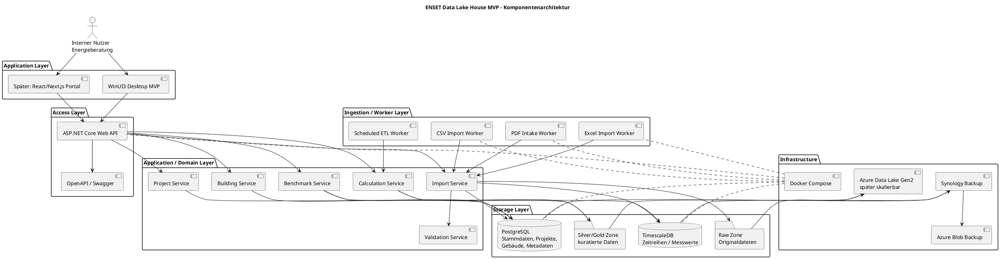

```plantuml

'--------------------------------------------------------------------------------------
'UML COMPONENTS DIAGRAM
'--------------------------------------------------------------------------------------
@startuml
title ENSET Data Lake House MVP - Komponentenarchitektur

actor "Interner Nutzer\nEnergieberatung" as User

package "Application Layer" {
  [WinUI3 Desktop MVP] as WinUI
  [Später: React/Next.js Portal] as WebUI
}

package "Access Layer" {
  [ASP.NET Core Web API] as API
  [OpenAPI / Swagger] as Swagger
}

package "Application / Domain Layer" {
  [Project Service] as ProjectService
  [Building Service] as BuildingService
  [Import Service] as ImportService
  [Calculation Service] as CalcService
  [Benchmark Service] as BenchmarkService
  [Validation Service] as ValidationService
}

package "Ingestion / Worker Layer" {
  [CSV Import Worker] as CsvWorker
  [Excel Import Worker] as ExcelWorker
  [PDF Intake Worker] as PdfWorker
  [Scheduled ETL Worker] as EtlWorker
}

package "Storage Layer" {
  database "PostgreSQL\nStammdaten, Projekte,\nGebäude, Metadaten" as PostgreSQL
  database "TimescaleDB\nZeitreihen / Messwerte" as Timescale
  folder "Raw Zone\nOriginaldateien" as Raw
  folder "Silver/Gold Zone\nkuratierte Daten" as Curated
}

package "Infrastructure" {
  [Docker Compose] as Docker
  [Synology Backup] as Synology
  [Azure Data Lake Gen2\nspäter skalierbar] as AzureLake
  [Azure Blob Backup] as AzureBackup
}

User --> WinUI
User --> WebUI

WinUI --> API
WebUI --> API
API --> Swagger

API --> ProjectService
API --> BuildingService
API --> ImportService
API --> CalcService
API --> BenchmarkService

ImportService --> ValidationService
CsvWorker --> ImportService
ExcelWorker --> ImportService
PdfWorker --> ImportService
EtlWorker --> CalcService

ProjectService --> PostgreSQL
BuildingService --> PostgreSQL
ImportService --> PostgreSQL
ImportService --> Timescale
ImportService --> Raw
CalcService --> Timescale
CalcService --> Curated
BenchmarkService --> Curated
BenchmarkService --> PostgreSQL

Raw --> AzureLake
Curated --> AzureLake
PostgreSQL --> Synology
Timescale --> Synology
Synology --> AzureBackup

Docker .. API
Docker .. CsvWorker
Docker .. ExcelWorker
Docker .. PdfWorker
Docker .. PostgreSQL
Docker .. Timescale

@enduml

'--------------------------------------------------------------------------------------
'DATA FLOW
'--------------------------------------------------------------------------------------
@startuml
title ENSET eKUT Data Lake House MVP - Datenfluss

actor "Energieberater" as User

participant "UI\nWinUI3/Blazor/React" as UI
participant "ASP.NET Core API" as API
participant "Import Service" as Import
participant "Validation Service" as Validation
database "PostgreSQL" as PG
database "TimescaleDB" as TS
collections "Raw Zone" as Raw
collections "Gold Zone" as Gold
participant "Calculation Service" as Calc
participant "Benchmark Service" as Bench

User -> UI: Projekt/Gebäude anlegen
UI -> API: POST /projects, /buildings
API -> PG: Stammdaten speichern

User -> UI: Datei importieren
UI -> API: POST /imports/files
API -> Import: ImportJob erstellen
Import -> Raw: Originaldatei speichern
Import -> Validation: Daten prüfen und normalisieren

Validation -> PG: Metadaten speichern
Validation -> TS: Messwerte speichern

Calc -> TS: Messdaten lesen
Calc -> PG: Gebäudedaten lesen
Calc -> Gold: Kennzahlen speichern

Bench -> Gold: Kennzahlen lesen
Bench -> PG: Vergleichsgruppen lesen
Bench -> API: Benchmark-Ergebnis

API -> UI: Dashboarddaten
UI -> User: Auswertung anzeigen

@enduml

'--------------------------------------------------------------------------------------
'Data Marketplace
'--------------------------------------------------------------------------------------
@startuml
title ENSET Data Marketplace Erweiterung

package "Data Lake House" {
  [Raw Data]
  [Processed Data]
  [KPI / Benchmark Engine]
}

package "Data Product Layer" {
  [Anonymization Service]
  [Aggregation Service]
  [Data Product Service]
  [Pricing Service]
  [Export Service]
}

package "Marketplace" {
  [Marketplace API]
  [Download / Purchase API]
}

package "Customers" {
  [eKUT Projects]
  [External Buyers]
}

[Processed Data] --> [Anonymization Service]
[Anonymization Service] --> [Aggregation Service]
[Aggregation Service] --> [Data Product Service]
[Data Product Service] --> [Pricing Service]
[Data Product Service] --> [Export Service]

[Export Service] --> [Marketplace API]
[Marketplace API] --> [External Buyers]

@enduml
```