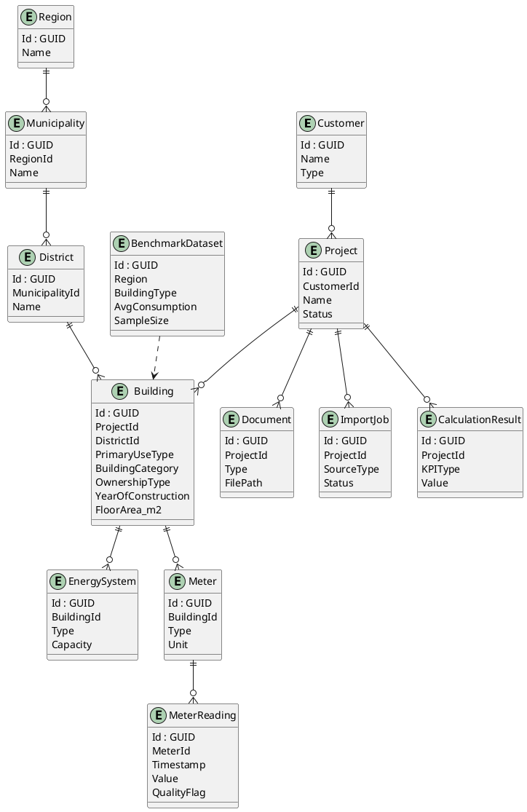
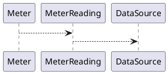

# Data Model

## Ziel
Das Datenmodell bildet die Grundlage für:
- Energieberatungsprojekte
- Gebäudestrukturen
- Energiedaten
- Benchmarking
- spätere Data Products

---

## Kernprinzip

Trennung von:
1. Stammdaten
2. Messdaten
3. Metadaten
4. Analyse-Daten

## Räumliches Ebenenmodell

Das Datenmodell muss Daten auf mehreren Ebenen speichern und auswerten können:

```text
Region
→ Municipality / Ort
→ District / Quartier
→ Building / (Betriebs-)Gebäude
→ EnergySystem / Meter
→ MeterReading
```

Ein Building ist das zentrale Objekt der Energieberatung. Es kann private, betriebliche oder öffentliche Gebäude abbilden, z. B. Wohnungen, Einfamilienhäuser, Mehrfamilienhäuser, Betriebe, Hallen, Schulen oder kommunale Gebäude.

---

## Haupt-Entities

### Customer
- Id (GUID)
- Name
- Type (Private, Company, Municipality)
- CreatedAt

---

### Project
- Id (GUID)
- CustomerId
- Name
- StartDate
- Status

---

### Building
- Id (GUID)
- ProjectId (GUID)
- DistrictId (GUID)
- Name
- PrimaryUseType (Residential, Commercial, Public, Mixed)
- BuildingCategory (Apartment, House, Office, Hall, School, Retail, Industry, Other)
- OwnershipType (OwnerOccupied, Rented, PublicOwned, CompanyOwned, Other)
- IsResidential
- IsCommercial
- IsPublic
- HasMixedUse
- YearOfConstruction
- FloorArea_m2

---

### EnergySystem
- Id (GUID)
- BuildingId
- Type (PV, Battery, Heating)
- Capacity
- InstallationYear

---

### Meter
- Id (GUID)
- BuildingId
- Type (Consumption, Production)
- Unit (kWh)
- ExternalId

---

### MeterReading (Timeseries!)
- Id (GUID)
- MeterId
- Timestamp
- Value
- Unit
- QualityFlag

---

### Document
- Id (GUID)
- ProjectId
- Type (Energieausweis, Rechnung)
- FilePath
- UploadedAt

---

### ImportJob
- Id (GUID)
- ProjectId
- SourceType (CSV, Excel, PDF, API)
- Status
- CreatedAt

---

### DataSource
- Id (GUID)
- Name
- Type (UserUpload, API, Sensor)

---

### CalculationResult
- Id (GUID)
- KPIType
- ScopeLevel (Region, Municipality, District, Building)
- ScopeId (GUID)
- Value
- Unit
- PeriodStart
- PeriodEnd
- CalculatedAt

---

### BenchmarkDataset
- Id (GUID)
- Category
- Region
- BuildingType
- BuildingCategory
- YearRange
- AvgConsumption
- SampleSize
- ScopeLevel

---

## Beziehungen



---

## Zeitreihenmodell (wichtig!)



👉 TimescaleDB empfohlen

---

## Datenzonen (Lake House)

- Raw: Originaldateien
- Silver: validierte Daten
- Gold: KPIs / Benchmarks

---

## Designentscheidungen

- GUIDs statt Integer (besser für Skalierung)
- Trennung von Meter und MeterReading
- flexible EnergySystem Struktur
- Benchmark als eigenes Dataset

---

## Nächste Schritte

- EF Core Entities erstellen
- Migration generieren
- erste Testdaten einfügen
- Importpipeline anbinden