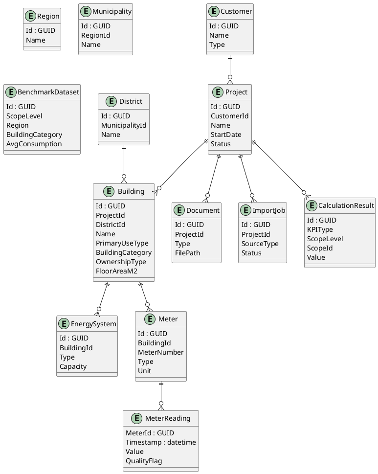

# Data Model

## Ziel
Das Datenmodell bildet die Grundlage für:
- Energieberatungsprojekte
- Gebäudestrukturen
- Energiedaten
- Benchmarking
- spätere Data Products

---

## Kernprinzip

Trennung von:
1. Stammdaten
2. Messdaten
3. Metadaten
4. Analyse-Daten

## Räumliches Ebenenmodell

Das Datenmodell muss Daten auf mehreren Ebenen speichern und auswerten können:

```text
Region
→ Municipality / Ort
→ District / Quartier
→ Building / Objekt
→ EnergySystem / Meter
→ MeterReading
```

Ein Building ist das zentrale Objekt der Energieberatung.

---

## Haupt-Entities

### Customer
- Id (GUID)
- Name
- Type
- CreatedAt

---

### Project
- Id (GUID)
- CustomerId
- Name
- StartDate
- Status

---

### Building
- Id (GUID)
- ProjectId
- DistrictId
- Name
- PrimaryUseType
- BuildingCategory
- OwnershipType
- IsResidential
- IsCommercial
- IsPublic
- HasMixedUse
- YearOfConstruction
- FloorAreaM2

---

### EnergySystem
- Id (GUID)
- BuildingId
- Type
- Capacity
- InstallationYear

---

### Meter
- Id (GUID)
- BuildingId
- MeterNumber
- Type
- Unit (Standard: kWh)
- ExternalId

---

### MeterReading (Timeseries)
- MeterId
- Timestamp
- Value
- Unit (Standard: kWh)
- QualityFlag
- Optional: CustomerId
- Optional: BuildingId
- Optional: SourceImportJobId

> `MeterReading` hat keinen eigenen `Id`; der Schlüssel besteht aus `MeterId + Timestamp`.

---

### Document
- Id (GUID)
- ProjectId
- Type
- FilePath
- UploadedAt

---

### ImportJob
- Id (GUID)
- ProjectId
- SourceType
- Status

> `ImportJob` ist derzeit als Modell in `Enset.Application` definiert, aber nicht als `DbSet` im `EnsetDbContext` eingebunden.

---

### DataSource
- Id (GUID)
- Name
- Type

> `DataSource` existiert im Domain-Layer, aber ebenfalls aktuell nicht als `DbSet` im DbContext.

---

### CalculationResult
- Id (GUID)
- KPIType
- ScopeLevel
- ScopeId
- Value
- Unit
- PeriodStart
- PeriodEnd
- CalculatedAt

---

### BenchmarkDataset
- Id (GUID)
- ScopeLevel
- Region
- BuildingCategory
- YearRange
- AvgConsumption
- SampleSize

---

## Beziehungen


