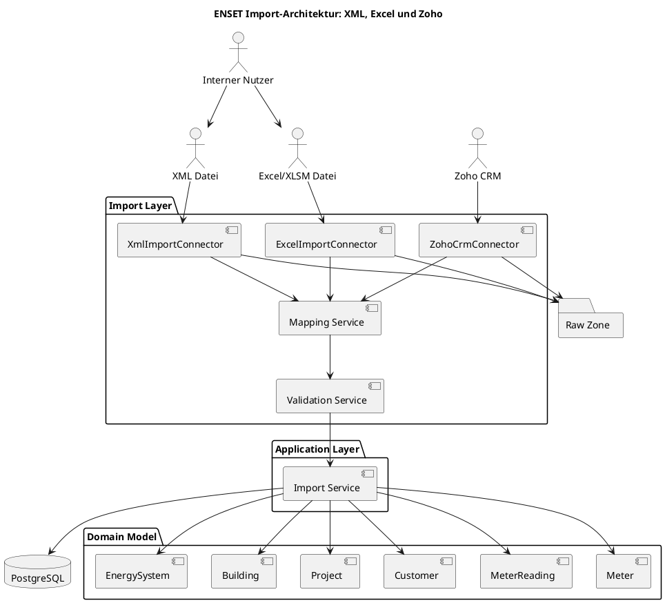

## Import-Architektur

```plantuml
@startuml
title ENSET Import-Architektur: XML, Excel und Zoho

actor "Interner Nutzer" as User
actor "Zoho CRM" as ZohoCRM
actor "XML Datei" as XML
actor "Excel/XLSM Datei" as Excel

package "Import Layer" {
  [XmlImportConnector] as XmlImport
  [ExcelImportConnector] as ExcelImport
  [ZohoCrmConnector] as ZohoConnector
  [Mapping Service] as Mapping
  [Validation Service] as Validation
}

package "Application Layer" {
  [Import Service] as ImportService
}

package "Domain Model" {
  [Customer]
  [Project]
  [Building]
  [EnergySystem]
  [Meter]
  [MeterReading]
}

database "PostgreSQL" as DB
folder "Raw Zone" as Raw

User --> Excel
User --> XML
ZohoCRM --> ZohoConnector
Excel --> ExcelImport
XML --> XmlImport

ExcelImport --> Raw
XmlImport --> Raw
ZohoConnector --> Raw

ExcelImport --> Mapping
XmlImport --> Mapping
ZohoConnector --> Mapping

Mapping --> Validation
Validation --> ImportService
ImportService --> DB
ImportService --> Customer
ImportService --> Project
ImportService --> Building
ImportService --> EnergySystem
ImportService --> Meter
ImportService --> MeterReading

@enduml
```