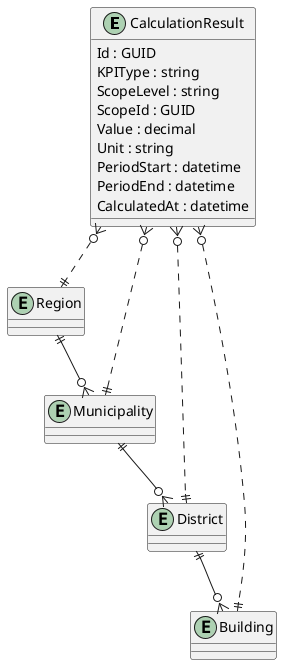

# KPIs

## Ziel
KPIs sollen auf mehreren Ebenen berechnet werden können:
- Objektebene
- Quartiersebene
- Ortsebene
- Regionsebene

Damit können Energieberatung, Benchmarking und spätere Data Products sauber aufgebaut werden.

## Ebenenmodell

```text
Region
→ Municipality / Ort
→ District / Quartier
→ Building / Objekt
→ EnergySystem / Meter
→ MeterReading
```

## KPI-Kategorien

### 1. Energieverbrauch
- Jahresverbrauch kWh/a
- Monatsverbrauch kWh/Monat
- spezifischer Verbrauch kWh/m²a
- Spitzenlast kW
- Grundlast kW

### 2. Energieerzeugung
- PV-Ertrag kWh/a
- spezifischer PV-Ertrag kWh/kWp
- Erzeugung pro m² Dachfläche
- Eigenverbrauchsanteil %
- Einspeiseanteil %

### 3. Autarkie & Eigenverbrauch
- Autarkiegrad %
- Eigenverbrauchsquote %
- Netzbezug kWh/a
- Netzeinspeisung kWh/a

### 4. CO₂
- CO₂-Ausstoß kg/a
- CO₂-Ausstoß kg/m²a
- CO₂-Einsparung kg/a
- CO₂-Einsparung %

### 5. Wirtschaftlichkeit
- Energiekosten EUR/a
- Einsparung EUR/a
- Investitionskosten EUR
- Amortisationsdauer Jahre
- Kapitalwert optional später
- interne Verzinsung optional später

### 6. Sanierung & Maßnahmen
- Einsparpotenzial kWh/a
- Einsparpotenzial EUR/a
- Verbesserung HWB / fGEE
- Maßnahmeneffekt %
- CO₂-Reduktion je Maßnahme

### 7. Benchmarking
- Verbrauch vs. Vergleichsgruppe
- CO₂ vs. Vergleichsgruppe
- Kosten vs. Vergleichsgruppe
- PV-Ertrag vs. regionaler Durchschnitt
- Gebäudeeffizienzklasse intern

## Aggregationslogik

KPIs müssen aggregierbar sein:

```text
Gebäude-KPIs
→ Quartier-KPIs
→ Orts-KPIs
→ Regions-KPIs
```

Beispiel:

```text
Jahresverbrauch Region =
Summe aller Jahresverbräuche der zugehörigen Orte/Quartiere/Objekte
```

## Technische Daten

In der aktuellen Codebasis ist die KPI-Entity definiert als `CalculationResult` mit folgenden Feldern:

- `KPIType`
- `ScopeLevel`
- `ScopeId`
- `Value`
- `Unit`
- `PeriodStart`
- `PeriodEnd`
- `CalculatedAt`

Einige konzeptionelle Felder wie `CalculationMethod` und `DataQuality` sind bisher nicht als Properties implementiert.

## KPI-Entity



## Benchmark-Daten

Die Entity `BenchmarkDataset` ist im Code definiert als Datensatz mit:

- `ScopeLevel`
- `Region`
- `BuildingCategory`
- `YearRange`
- `AvgConsumption`
- `SampleSize`

## Wichtig für Data Products

Für verkaufbare Datensätze dürfen KPIs nur anonymisiert und aggregiert verwendet werden.

Geeignete Ebenen:
- Quartier, wenn genügend Objekte vorhanden sind
- Ort
- Region
- Gebäudetyp-Cluster
- Baujahr-Cluster
- Nutzungstyp-Cluster

Nicht geeignet:
- einzelne Kunden
- einzelne Adressen
- einzelne Gebäude ohne Aggregation